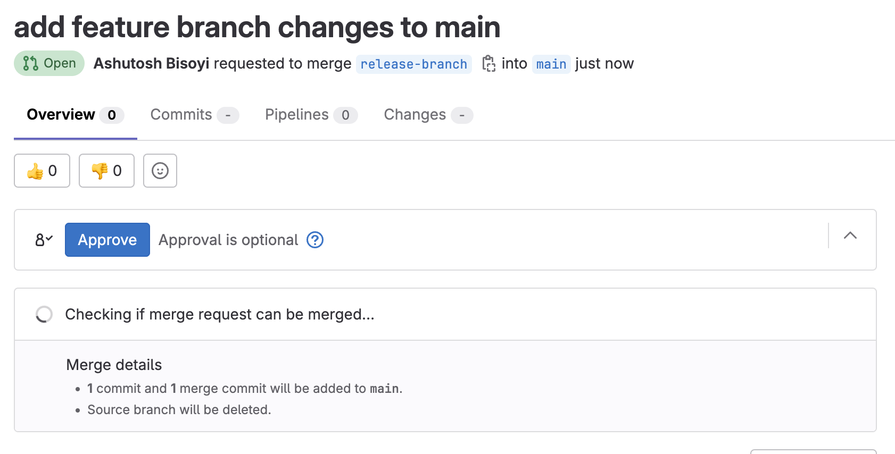
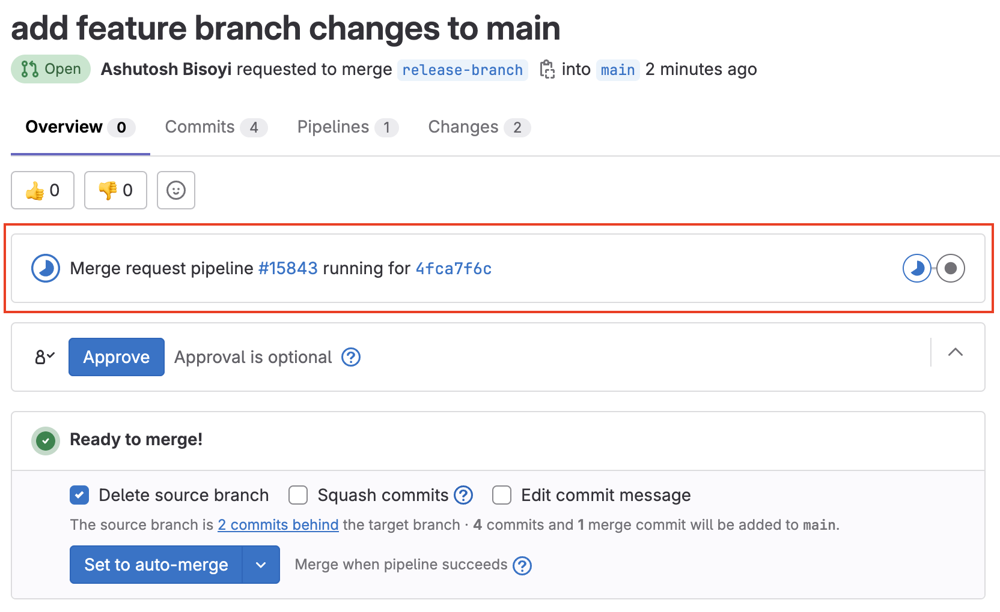
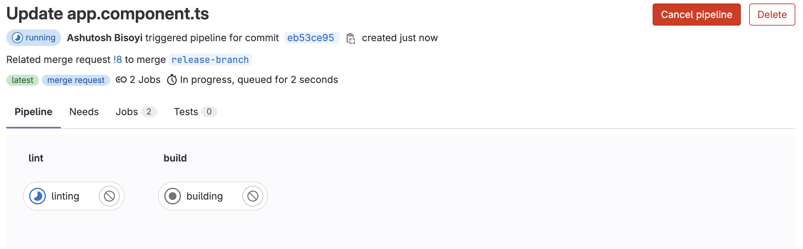
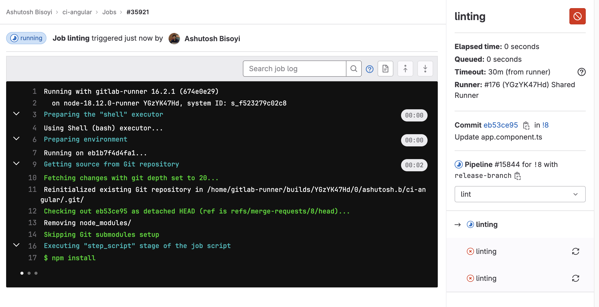
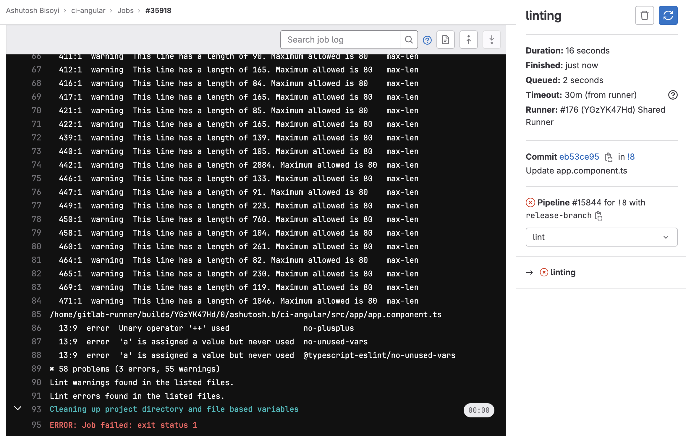
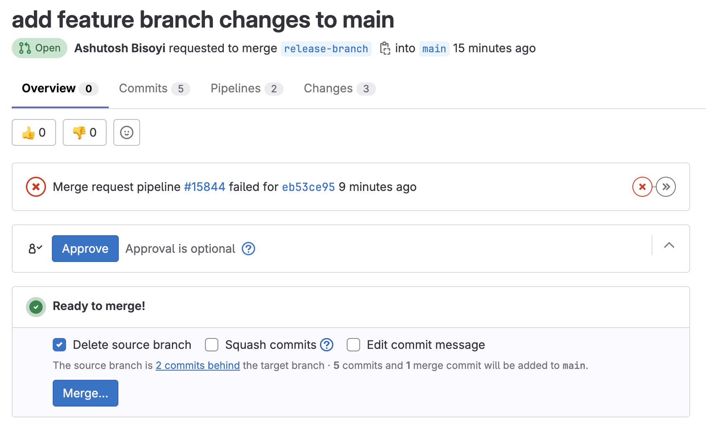
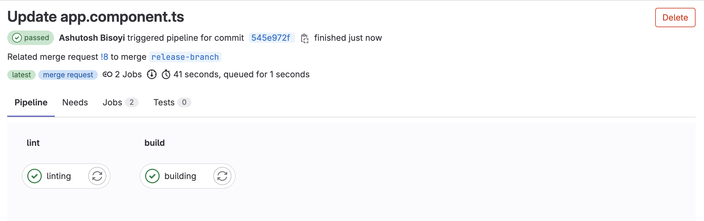

# Continuous Integration (CI) Setup for Angular Application in GitLab

## Table of Contents

- [Continuous Integration (CI) Setup for Angular Application in GitLab](#continuous-integration-ci-setup-for-angular-application-in-gitlab)
  - [Table of Contents](#table-of-contents)
  - [1. Introduction](#1-introduction)
    - [Purpose](#purpose)
    - [Scope](#scope)
  - [2. Prerequisites](#2-prerequisites)
  - [3. Setting Up Continuous Integration (CI) for Angular App](#3-setting-up-continuous-integration-ci-for-angular-app)
    - [Creating a `.gitlab-ci.yml` File](#creating-a-gitlab-ciyml-file)
    - [Using Docker Image](#using-docker-image)
    - [Defining Stages](#defining-stages)
    - [Writing Jobs for Linting and Building](#writing-jobs-for-linting-and-building)
    - [Specifying Conditions with Rules](#specifying-conditions-with-rules)
    - [Complete `.gitlab-ci.yml` Configuration](#complete-gitlab-ciyml-configuration)
  - [4. Testing the CI Pipeline](#4-testing-the-ci-pipeline)
    - [Creating Merge Requests](#creating-merge-requests)
    - [Observing CI/CD Pipeline Execution](#observing-cicd-pipeline-execution)
  - [5. Visualizing the CI Process in GitLab](#5-visualizing-the-ci-process-in-gitlab)
    - [1. Developer Creates Merge Request](#1-developer-creates-merge-request)
    - [2. CI Pipeline Initiation](#2-ci-pipeline-initiation)
    - [3. Job Stages](#3-job-stages)
    - [4. Merge Request Integration](#4-merge-request-integration)
  - [6. Troubleshooting and Advanced Configuration](#6-troubleshooting-and-advanced-configuration)
    - [Handling Merge Conflicts](#handling-merge-conflicts)
    - [Customizing Scripts](#customizing-scripts)
  - [7. Conclusion](#7-conclusion)
    - [Benefits of CI Setup](#benefits-of-ci-setup)
    - [Future Enhancements](#future-enhancements)


## 1. Introduction

### Purpose
The purpose of this document is to provide a step-by-step guide for setting up a Continuous Integration (CI) pipeline for an Angular application in GitLab. The CI pipeline will automate linting and building processes to ensure code quality and reliability.

### Scope
This document covers the basic setup of a CI pipeline for an Angular application in GitLab, focusing on linting and building stages. More advanced topics, such as deployment and additional stages, are outside the scope of this guide.


## 2. Prerequisites

Before setting up the CI pipeline, ensure you have the following prerequisites:

- A GitLab account with access to your target repository.
- An Angular application repository hosted on GitLab.
- Node.js and npm installed on your local machine.


## 3. Setting Up Continuous Integration (CI) for Angular App

### Creating a `.gitlab-ci.yml` File
1. Navigate to your Angular application repository on GitLab.
2. Create a file named `.gitlab-ci.yml` in the root directory.

### Using Docker Image
The image keyword in the CI configuration specifies the Docker image to be used as the execution environment for the CI jobs. In this example, we're using the node:16.20-alpine Docker image to provide the necessary tools and dependencies for running the linting and building tasks.

### Defining Stages
Define the stages for your CI pipeline. In this guide, we will use two stages: `lint` and `build`.

```yaml
stages:
  - lint
  - build
```

### Writing Jobs for Linting and Building
Create jobs within each stage to perform linting and building tasks.

```yaml
linting:
  stage: lint
  script:
    - npm install
    - npm run lint
  rules:
    - if: '$CI_PIPELINE_SOURCE == "merge_request_event" && ($CI_MERGE_REQUEST_TARGET_BRANCH_NAME == "main" || $CI_MERGE_REQUEST_TARGET_BRANCH_NAME == "development")'

building:
  stage: build
  script:
    - npm install
    - npm run build
  rules:
    - if: '$CI_PIPELINE_SOURCE == "merge_request_event" && ($CI_MERGE_REQUEST_TARGET_BRANCH_NAME == "main" || $CI_MERGE_REQUEST_TARGET_BRANCH_NAME == "development")'
  dependencies:
    - linting

```

### Specifying Conditions with Rules
The rules section specifies when a job should run. In this example, jobs will run for merge requests targeting the main, development".

You can modify the rules as per your needs. For example if you want to run the jobs for merge requests targeting any release branch you can modify the condition as following:

```yaml
- if: '$CI_PIPELINE_SOURCE == "merge_request_event" && ($CI_MERGE_REQUEST_TARGET_BRANCH_NAME == "main" || $CI_MERGE_REQUEST_TARGET_BRANCH_NAME == "development" || $CI_MERGE_REQUEST_TARGET_BRANCH_NAME =~ /^release.*/ )'
```

### Complete `.gitlab-ci.yml` Configuration
Here is the completed configuration for your .gitlab-ci.yml file:

```yaml
image: node:16.20-alpine

stages:
  - lint
  - build

linting:
  stage: lint
  script:
    - npm install
    - npm run lint
  rules:
    - if: '$CI_PIPELINE_SOURCE == "merge_request_event" && ($CI_MERGE_REQUEST_TARGET_BRANCH_NAME == "main" || $CI_MERGE_REQUEST_TARGET_BRANCH_NAME == "development")'

building:
  stage: build
  script:
    - npm install
    - npm run build
  rules:
    - if: '$CI_PIPELINE_SOURCE == "merge_request_event" && ($CI_MERGE_REQUEST_TARGET_BRANCH_NAME == "main" || $CI_MERGE_REQUEST_TARGET_BRANCH_NAME == "development")'
  dependencies:
    - linting

```

## 4. Testing the CI Pipeline

### Creating Merge Requests
1. Create a new branch in your Angular application repository.
2. Make changes to your code and push the branch to GitLab.
3. Create a merge request (MR) targeting the main or development branch.

### Observing CI/CD Pipeline Execution

1. Navigate to your merge request on GitLab.
2. Observe the CI/CD pipeline execution as it runs the linting and building stages.
3. Check the CI/CD job logs for any errors or warnings.
4. Ensure that the pipeline status reflects the success or failure of the linting and building stages.

## 5. Visualizing the CI Process in GitLab
In this section, we will visually explain the Continuous Integration (CI) process in GitLab and how it works for your Angular application.

### 1. Developer Creates Merge Request
When a developer completes a feature or bug fix, they create a new branch in the GitLab repository. They then make changes to the code and create a Merge Request (MR) for code review.


### 2. CI Pipeline Initiation
Upon MR creation, GitLab's CI/CD pipeline is automatically triggered. The .gitlab-ci.yml configuration file you've set up defines the stages and jobs to be executed in the pipeline. In our case, the stages are lint and build.


### 3. Job Stages
In the `lint` and `build` stage, the CI pipeline installs the necessary dependencies using Node.js and npm. It then runs the linting process on the codebase to check for any coding standards violations or errors.




- If Linting or Build Fails:
  - The CI pipeline reports issues in the job logs.
  - The Merge Request status is updated to indicate that the pipeline failed.
  - Developers review the errors in the job logs and make necessary code changes.
  
  

- If Linting and Build Passes:
  - The Merge Request status is updated to indicate that the linting stage passed.
    
    

All the pipeline and job actions can be seen and reviewd under the build menu of gitlab


### 4. Merge Request Integration

The maintainer can now review the linting and building results in the Merge Request itself. If the pipeline indicates success, it signifies that the code adheres to coding standards and that the build process was successful. This reduces the risk of merging code that may cause errors or disrupt the application.

## 6. Troubleshooting and Advanced Configuration

### Handling Merge Conflicts
If your merge request encounters merge conflicts during the auto-merge stage, manual intervention may be required to resolve the conflicts before the pipeline can proceed.

### Customizing Scripts
Modify the scripts in the .gitlab-ci.yml file to match your specific linting and building commands and any additional requirements of your Angular application.


## 7. Conclusion

### Benefits of CI Setup
Setting up a CI pipeline for your Angular application offers several benefits:

- Improved code quality through automated linting.
- Consistent and reliable builds.
- Early detection of errors and issues.
- Streamlined collaboration through automated testing of merge requests.

### Future Enhancements
Consider enhancing your CI pipeline by adding additional stages such as unit testing, integration testing, and deployment to further improve the quality and reliability of your Angular application.