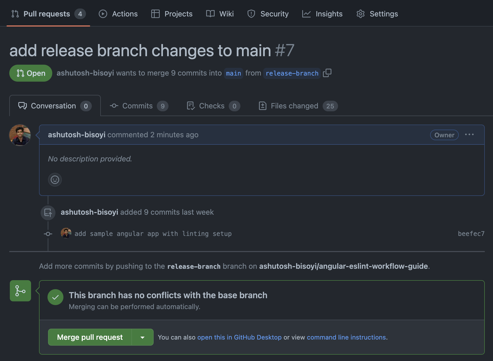
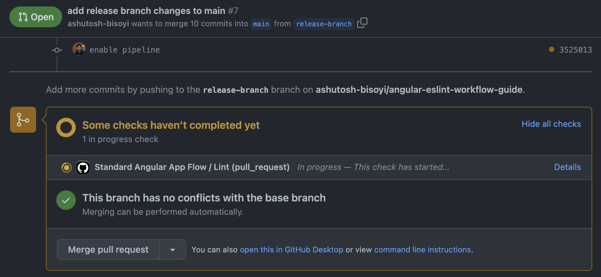
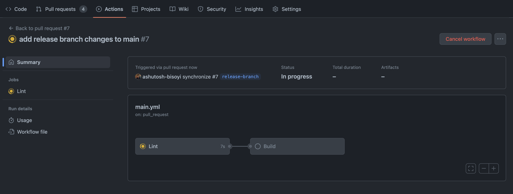
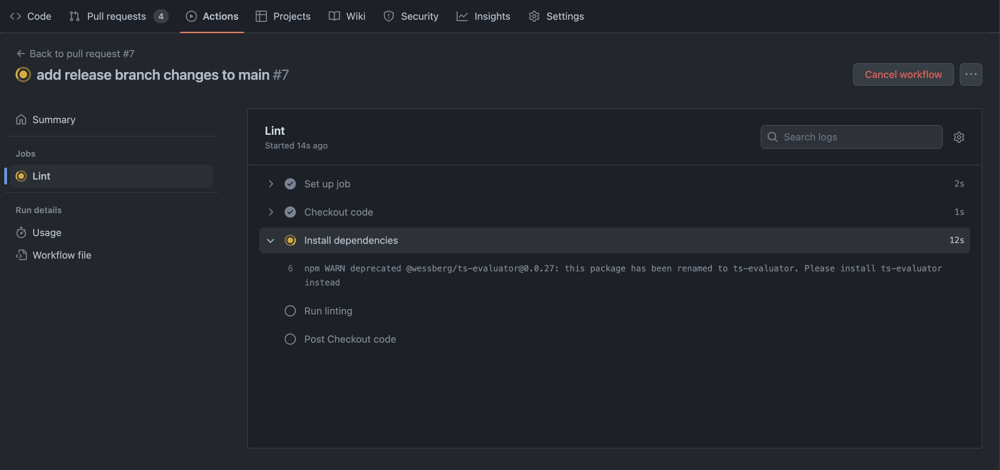
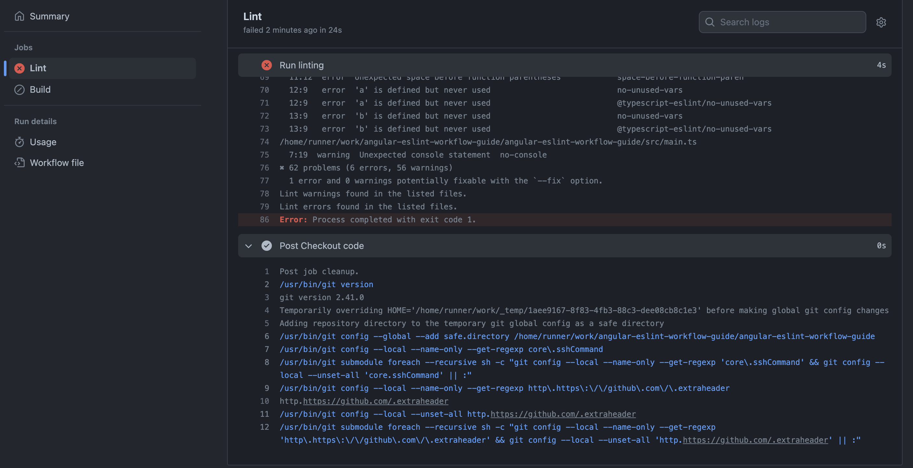
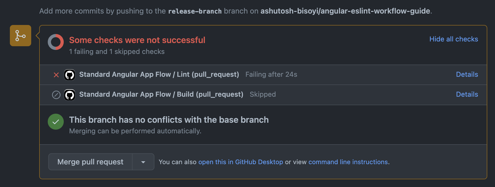
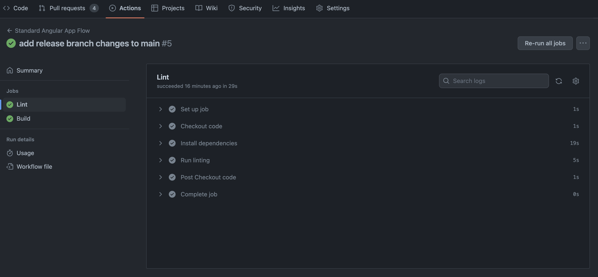
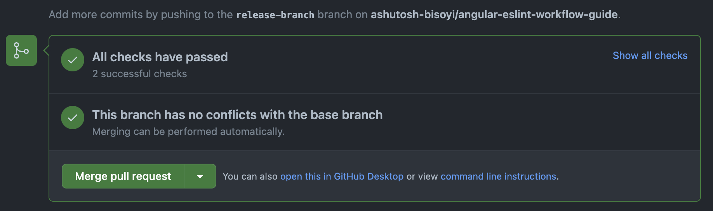
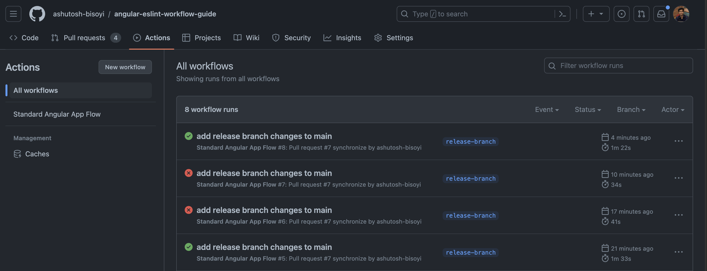

# Setting GitHub Actions for Angular Application

## Table of Contents

- [Setting GitHub Actions for Angular Application](#setting-github-actions-for-angular-application)
  - [Table of Contents](#table-of-contents)
  - [1. Introduction](#1-introduction)
    - [Purpose](#purpose)
    - [Scope](#scope)
  - [2. Prerequisites](#2-prerequisites)
  - [3. Setting Up Workflow for Angular App](#3-setting-up-workflow-for-angular-app)
    - [Creating a `.yml` File](#creating-a-yml-file)
    - [Assign Name](#assign-name)
    - [Defining Workflow Triggers](#defining-workflow-triggers)
    - [Writing Jobs for Linting and Building](#writing-jobs-for-linting-and-building)
    - [Complete `main.yml` Configuration](#complete-mainyml-configuration)
  - [4. Testing the Workflow](#4-testing-the-workflow)
    - [Creating Pull Requests](#creating-pull-requests)
    - [Observing Workflow Execution](#observing-workflow-execution)
  - [5. Visualizing the Workflow in GitHub](#5-visualizing-the-workflow-in-github)
    - [1. Developer Creates Pull Request](#1-developer-creates-pull-request)
    - [2. Workflow Initiation](#2-workflow-initiation)
    - [3. Job Stages](#3-job-stages)
    - [4. Pull Request Integration](#4-pull-request-integration)
  - [6. Pre-Merge Checks and Bypassing Workflow Checks](#6-pre-merge-checks-and-bypassing-workflow-checks)
  - [7. Troubleshooting and Advanced Configuration](#7-troubleshooting-and-advanced-configuration)
    - [Handling Merge Conflicts](#handling-merge-conflicts)
    - [Customizing Scripts](#customizing-scripts)
  - [8. Sample Repository](#8-sample-repository)
  - [9. Conclusion](#9-conclusion)
    - [Benefits of Workflow Setup](#benefits-of-workflow-setup)
    - [Future Enhancements](#future-enhancements)


## 1. Introduction

### Purpose
The purpose of this document is to provide a step-by-step guide for setting up a Workflow via GitHub actions for an Angular application. The workflow will automate linting and building processes to ensure code quality and reliability.

### Scope
This document covers the basic setup of a Workflow via GitHub actions for an Angular application, focusing on linting and building stages. More advanced topics, such as deployment and additional stages, are outside the scope of this guide.

[Back to top](#table-of-contents)
## 2. Prerequisites

Before setting up the workflow, ensure you have the following prerequisites:

- A GitHub account with access to your target repository.
- An Angular application repository hosted on GitHub.
- Node.js and npm installed on your local machine.
- All required configurations done as per [Angular coding standards](https://github.com/OsmosysSoftware/dev-standards/blob/main/coding-standards/angular.md)

[Back to top](#table-of-contents)
## 3. Setting Up Workflow for Angular App

### Creating a `.yml` File
1. Navigate to your Angular application repository on GitHub.
2. Create a folder named `github` in the root directory.
3. Inside `github` folder create a new folder called `workflows`.
4. Create a file named `main.yml` inside `workflows` folder.

### Assign Name
Assign a name to your workflow.

```yaml
name: Standard Angular App Flow
```

### Defining Workflow Triggers
To control when your workflow is executed, you can define its trigger conditions using the on keyword. In the example below, the workflow is set to trigger on each pull request made to the main or development branch:

```yaml
on:
  pull_request:
    branches: [ "main", "development" ]
```

You can modify the above as per your needs. For example if you want to run the jobs for merge requests targeting any release branch you can modify the condition as following:

```yaml
on:
  pull_request:
    branches: [ "main", "development", "release.*" ]
```

### Writing Jobs for Linting and Building
Create jobs within each stage to perform linting and building tasks. We will have to jobs in this workflow. One is linting and another is building.

```yaml
jobs:
  lint:
    name: Lint
    runs-on: ubuntu-latest
    steps:
      - name: Checkout code
        uses: actions/checkout@v3

      - name: Set up Node.js
        uses: actions/setup-node@v3
        with:
          node-version: '18'  # Adjust this to the Node.js version your project needs

      - name: Install dependencies
        run: npm install

      - name: Run linting
        run: npm run lint

  build:
    name: Build
    runs-on: ubuntu-latest
    needs: lint
    steps:
      - name: Checkout code
        uses: actions/checkout@v3

      - name: Set up Node.js
        uses: actions/setup-node@v3
        with:
          node-version: '18'  # Adjust this to the Node.js version your project needs

      - name: Install dependencies
        run: npm install

      - name: Build app
        run: npm run build
```

### Complete `main.yml` Configuration
Here is the completed configuration for your main.yml file:

```yaml
name: Standard Angular App Flow

on:
  pull_request:
    branches: [ "main", "development" ]

jobs:
  lint:
    name: Lint
    runs-on: ubuntu-latest
    steps:
      - name: Checkout code
        uses: actions/checkout@v3

      - name: Set up Node.js
        uses: actions/setup-node@v3
        with:
          node-version: '18'  # Adjust this to the Node.js version your project needs

      - name: Install dependencies
        run: npm install

      - name: Run linting
        run: npm run lint

  build:
    name: Build
    runs-on: ubuntu-latest
    needs: lint
    steps:
      - name: Checkout code
        uses: actions/checkout@v3

      - name: Set up Node.js
        uses: actions/setup-node@v3
        with:
          node-version: '18'  # Adjust this to the Node.js version your project needs

      - name: Install dependencies
        run: npm install

      - name: Build app
        run: npm run build
```
[Back to top](#table-of-contents)
## 4. Testing the Workflow

### Creating Pull Requests
1. Create a new branch in your Angular application repository.
2. Make changes to your code and push the branch to GitHub.
3. Create a pull request (PR) targeting the main or development branch.

### Observing Workflow Execution

1. Navigate to your pull request on GitHub.
2. Observe the workflow execution as it runs the linting and building stages.
3. Check the job logs for any errors or warnings.
4. Ensure that the workflow status reflects the success or failure of the linting and building stages.

[Back to top](#table-of-contents)
## 5. Visualizing the Workflow in GitHub
In this section, we will visually explain the workflow process in GitHub and how it works for your Angular application.

### 1. Developer Creates Pull Request
When a developer completes a feature or bug fix, they create a new branch in the GitHub repository. They then make changes to the code and create a Pull Request (PR) for code review.



### 2. Workflow Initiation
Upon PR creation, GitHub Action's workflow is automatically triggered. The main.yml configuration file you've set up defines the stages and jobs to be executed in the workflow. In our case, the stages are lint and build.



### 3. Job Stages
In the `lint` and `build` stage, the workflow installs the necessary dependencies using Node.js and npm. It then runs the linting process on the codebase to check for any coding standards violations or errors.




- If Linting or Build Fails:
  - The workflow reports issues in the job logs.
  - The Pull Request status is updated to indicate that the workflow failed.
  - Developers review the errors in the job logs and make necessary code changes.

  
  

- If Linting and Build Passes:
  - The Pull Request status is updated to indicate that the linting stage passed.

    
    

All the workflows can be seen and reviewed under the Actions tab of GitHub



### 4. Pull Request Integration

The maintainer can now review the linting and building results in the Pull Request itself. If the workflow indicates success, it signifies that the code adheres to coding standards and that the build process was successful. This reduces the risk of merging code that may cause errors or disrupt the application.

[Back to top](#table-of-contents)
## 6. Pre-Merge Checks and Bypassing Workflow Checks
Before merging any changes into the main codebase, it's essential to ensure that the workflow checks have been successfully completed. These checks verify that code changes adhere to coding standards, pass tests, and build successfully. To enforce this, follow these steps:

1. **Review Workflow Status:** When a Pull Request (PR) is created, monitor the workflow's progress and results. Ensure that all stages, such as linting and building, complete successfully.
2. **Merge Only After Success:** As a maintainer, it's crucial to enforce the policy of merging changes only when the workflow passes without errors. If the workflow fails, work with the contributor to address the issues before proceeding with the merge.
3. **Bypass Workflow Check:** In certain scenarios, there may be valid reasons for bypassing the workflow checks temporarily. It's recommended that leads add a comment in the PR describing the reason for bypassing the workflow checks. This helps maintain a record of the decision and the context behind it.

Please note that bypassing workflow checks should be used sparingly and only in exceptional cases. The goal is to maintain code quality and ensure that the workflow process is an integral part of our development workflow.

[Back to top](#table-of-contents)
## 7. Troubleshooting and Advanced Configuration

### Handling Merge Conflicts
If your pull request encounters merge conflicts during the auto-merge stage, manual intervention may be required to resolve the conflicts before the workflow can proceed.

### Customizing Scripts
Modify the scripts in the main.yml file to match your specific linting and building commands and any additional requirements of your Angular application.

[Back to top](#table-of-contents)

## 8. Sample Repository

[Repository Link](https://github.com/OsmosysSoftware/angular-eslint-workflow-guide) 

Explore this for practical demonstration of CI setups.

## 9. Conclusion

### Benefits of Workflow Setup
Setting up a workflow for your Angular application offers several benefits:

- Improved code quality through automated linting.
- Consistent and reliable builds.
- Early detection of errors and issues.
- Streamlined collaboration through automated testing of merge requests.

### Future Enhancements
Consider enhancing your workflow by adding additional stages such as unit testing, integration testing, and deployment to further improve the quality and reliability of your Angular application.

[Back to top](#table-of-contents)
