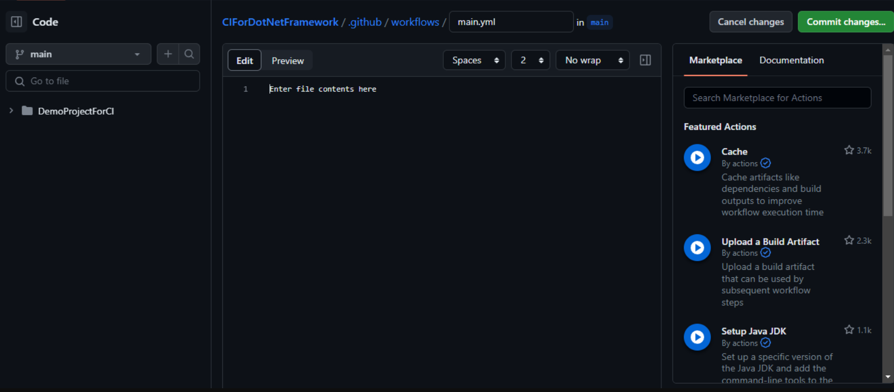
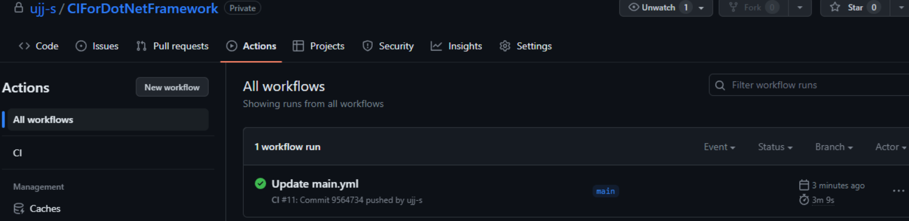
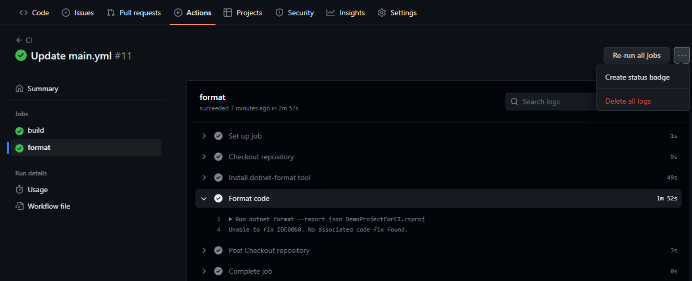
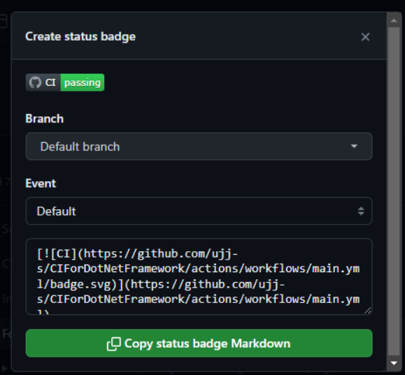

# CI for .NET projects on GitHub

# Introduction

## Purpose

The purpose of this document is to provide a step-by-step guide for a developer to setup CI (Continuous Integration) in their .NET projects via workflows from GitHub Actions. This document provides support to both modern .NET (Core and beyond) and .NET Framework too.

## Scope

The scope of this document covers the following

1. Setting up the YAML required to enable document for GitHub’s CI.
2. Configuring the repo to enable CI.
3. Testing the Workflow.

# Prerequisites

1. A GitHub account with access to your target repository.
2. A .NET application repository on GitHub.
3. The projects has to be setup with EditorConfig for catching issues related to linting and code analysis.

# Setting up CI for a .NET project

## Creating a `main.yml` file

The yaml file can be created in two ways:
1. The `main.yml` can be created using Actions tab in the project repository and clicking on "set up a workflow yourself". This will redirect you to a .github/workflows/main.yml file.



2. Create a `.github/workflows/main.yml` file in the project repository directly.

Note: The `main.yml` file contains set of instructions that are responsible for building or formatting a repository.

## Defining stages

### For modern .NET (.NET Core and above)

We will need to setup one stage for .NET core projects. The name of this stage should be `build` . Set the variable of the `dotnet-version` targeting the version of .NET your application is using.

```yaml
name: CI For DotNet Core

on:
  push:
    branches: *
  pull_request:
    branches: *

jobs:
  build:

    runs-on: ubuntu-latest

    steps:
    - uses: actions/checkout@v3
    - name: Setup .NET
      uses: actions/setup-dotnet@v3
      with:
        dotnet-version: 6.0.x
    - name: Restore dependencies
      run: dotnet restore
    - name: Build
      run: dotnet build --no-restore
    - name: Test
      run: dotnet test --no-build --verbosity normal
```

### For .NET Framework (4.5.2)

We need to setup two stages to setup CI for projects built using .NET Framework.

1. `build` stage
2. `format` stage

```yaml
name: name: CI

on:
  push:
    branches:
      - '*'
  pull_request:
    branches:
      - '*'

jobs:
  build:
    runs-on: windows-latest

    steps:
      - name: Checkout repository
        uses: actions/checkout@v2

      - name: Build
        run: cmd /c "C:\Windows\Microsoft.NET\Framework\v4.0.30319\MSBuild.exe" /p:Configuration=Release

   
  format:
    runs-on: windows-latest

    steps:
      - name: Checkout repository
        uses: actions/checkout@v2

      - name: Install dotnet-format tool
        run: dotnet tool install -g dotnet-format

      - name: Format code
        run: dotnet format --report msbuild DemoProjectForCI.csproj
```

# Testing the Workflow

Go to the "Actions" tab on the GitHub repository. A new workflow is triggered after a commit is made.



We can check the progress and the logs after running the workflow. We can also create a status or build badge that can be added to the Readme file and can give us an idea of the Status.





# Conclusion

## Benefits of CI Setup

Setting up a CI pipeline for your .NET application offers several benefits:

- Improved code quality through automated linting.
- Consistent and reliable builds.
- Early detection of errors and issues.
- Streamlined collaboration through automated testing of merge requests.

## Future Enhancements

Consider enhancing your CI pipeline by adding additional stages such as unit testing, integration testing, and deployment to further improve the quality and reliability of your .NET application.
