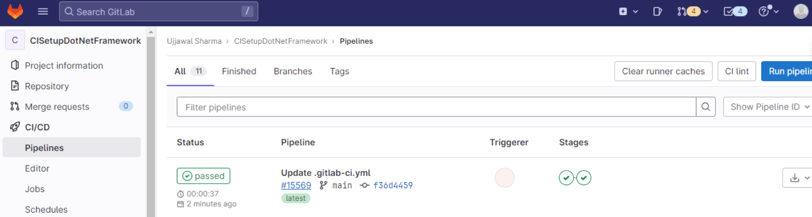
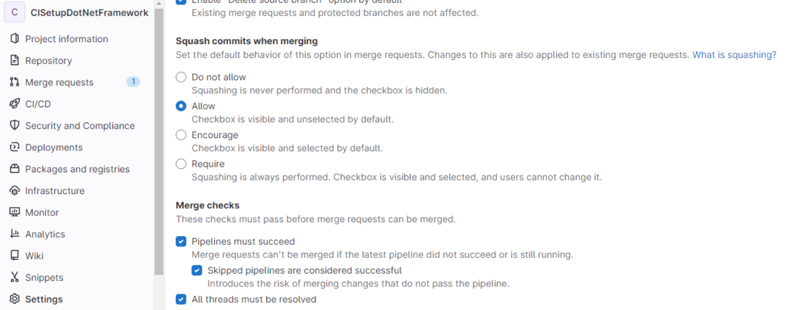

# CI for .NET projects on Gitlab

# Introduction

## Purpose

The purpose of this document is to provide a step-by-step guide for a developer to setup CI (Continuous Integration) in their .NET projects. This document provides support to both modern .NET (Core and beyond) and .NET Framework too.

## Scope

The scope of this document covers the following

1. Setting up the YAML required to enable document for Gitlab’s CI.
2. Configuring the repo to enable CI.
3. Testing the CI pipeline.

# Prerequisites

1. If Gitlab is managed by your organization, ensure that CI runner is configured to build .NET applications by the IT team of the organization.
2. A GitLab account with access to your target repository.
3. A .NET application repository on Gitlab.
4. The projects has to be setup with EditorConfig for catching issues related to linting and code analysis.

# Setting up CI for a .NET project

## Creating a `.gitlab-ci-yml` file

1. Navigate to the .NET application repository on Gitlab.
2. Create a file named `.gitlab-ci.yml` in the root directory.

## Defining stages

### For modern .NET (.NET Core and above)

We will need to setup one stage for .NET core projects. The name of this stage should be `build` . Set the variable of the `DOTNET_VERSION` targeting the version of .NET your application is using.

```yaml
stages:
  - build

variables:
  DOTNET_VERSION: "7.0.x"

build:
  stage: build
  tags: 
     - ".NET Core"
  image: mcr.microsoft.com/dotnet/sdk:$DOTNET_VERSION
  script:
    - dotnet restore
    - dotnet build --no-restore
```

### For .NET Framework (4.5.2)

We need to setup two stages to setup CI for projects built using .NET Framework.

1. `build` stage
2. `format` stage

```yaml
stages:
  - build
  - format

build:
  stage: build
  tags:
    - ".NET Framework"
  script:
    - "C:\\Windows\\Microsoft.NET\\Framework\\v4.0.30319\\MSBuild.exe"

format:
  stage: format
  tags:
    - ".NET Framework"
  script:
    - "dotnet format --report msbuild ConsoleApp1.csproj"
    - $format_file_content = Get-Content "msbuild\format-report.json" -raw
    - if ($format_file_content -eq "[]") { exit 0  } else { exit 1 }
```

# Testing the CI pipeline

Once the YAML file is setup and the Gitlab CI runner functioning properly, the builds should happen on every commit to the repository. As shown in the image.



# Pre-merge checks and bypassing CI checks

In the repository, go to Settings > Merge Requests > Merge Checks and check the box as in the image. This will enable pre-check on the pull requests. Everytime a PR is ready to be merged, a build pipeline is invoked to run the CI tasks.



# Conclusion

## Benefits of CI Setup

Setting up a CI pipeline for your .NET application offers several benefits:

- Improved code quality through automated linting.
- Consistent and reliable builds.
- Early detection of errors and issues.
- Streamlined collaboration through automated testing of merge requests.

## Future Enhancements

Consider enhancing your CI pipeline by adding additional stages such as unit testing, integration testing, and deployment to further improve the quality and reliability of your .NET application.
