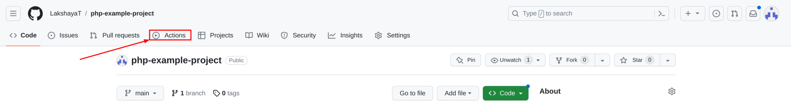
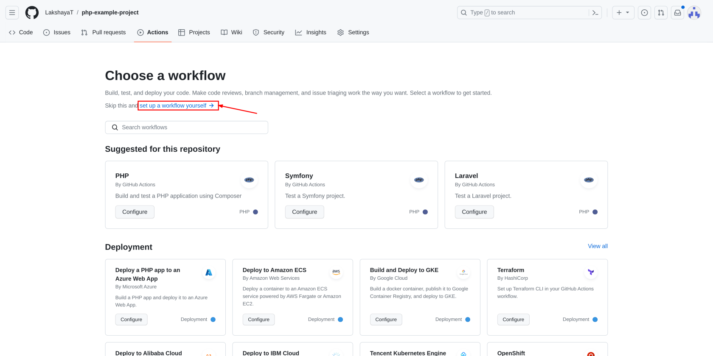
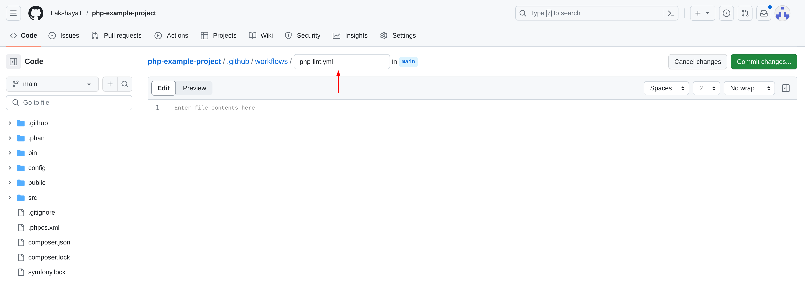
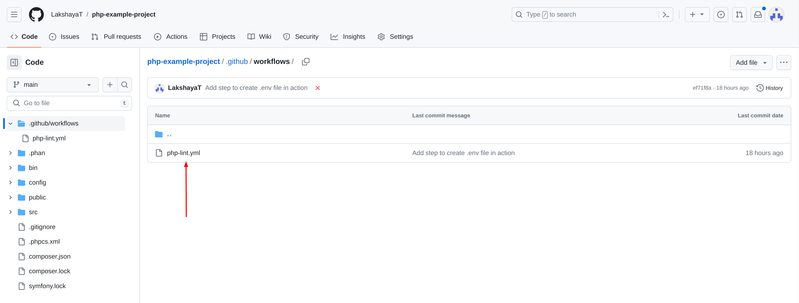
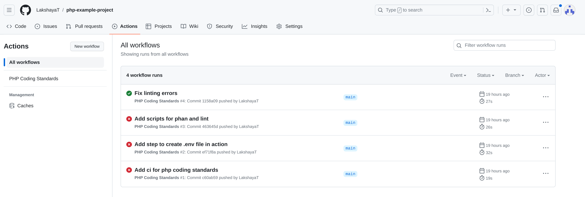
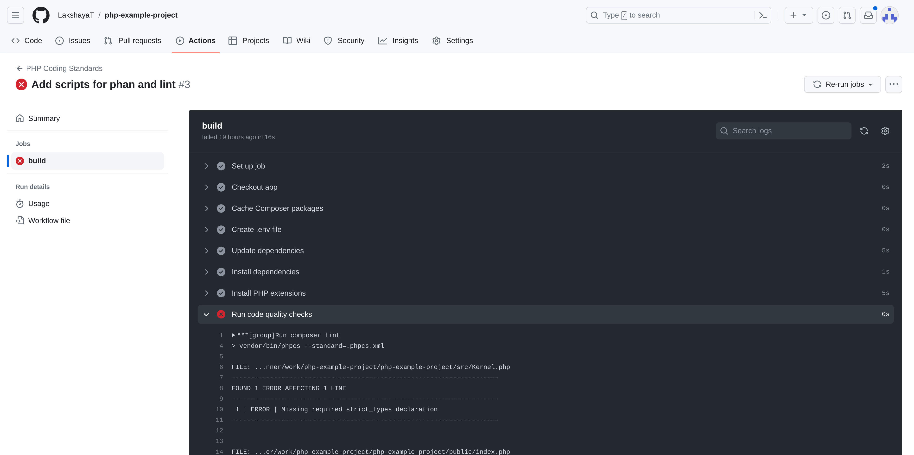
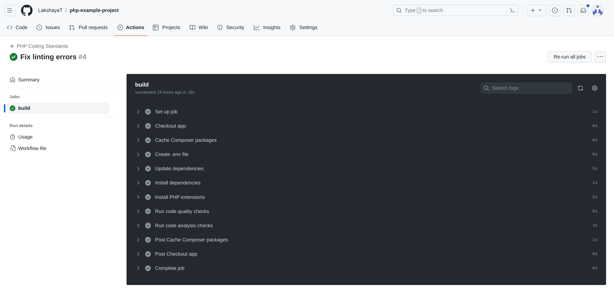

# Setup Continuous Integration (CI) on Github for PHP projects

## Introduction

Continuous Integration (CI) in GitHub is a software development practice that involves automatically integrating code changes from multiple developers into a shared repository on a frequent and ongoing basis. The main goal of CI is to detect and address integration issues early in the development process, ensuring that code changes are tested, validated, and merged into the main codebase as smoothly as possible.

Github provides [Github Actions](https://github.com/features/actions) that can be used to create [workflows](https://docs.github.com/en/actions/using-workflows/about-workflows) that can be used for performing coding standards checks for various programming languages, including PHP.

This page will walk you through the steps of setting up a Github Action workflow for performing PHP codings standards checks with PHPCS and Phan for linting and analysis of code.

## Setting up Github Actions for project

### Pre-requisites

- An existing or new repository with the PHP project
- All required configurations done as per [Enforcing tools and config](https://github.com/OsmosysSoftware/dev-standards/blob/main/coding-standards/php.md#enforcing-tools-and-config)

### Creating a workflow

A workflow is a configurable automated process that will run one or more jobs. Workflows are defined by a YAML file checked in to your repository and will run when triggered by an event in your repository. These files are defined in `.github/workflows`.

There are two methods that can be followed for creating a workflow:

#### Method 1: Using Github UI

1. Open your project repository and click on the **Actions** tab

    

2. A new page **Choose a workflow** will open, click on the **setup a workflow yourself** link

    

    > Note: In case the project already has some other workflows set up, click on the **New workflow** button on the left side. This will take you to the above page.

3. A new page will open which will by default create a new file `.github/workflows/main.yml` in edit mode. For the purposes of this guide, we will rename the file to `php-lint.yml`, though it can be named as seemed fit.

    

4. Add the following contents to this file:

    ```yaml
    name: PHP Coding Standards
    on:
      push:
        branches: [ main ]
      pull_request:
        branches: [ main ]

    permissions:
      contents: read

    jobs:
      build:
        runs-on: ubuntu-latest
        steps:
        - name: Checkout app
          uses: actions/checkout@v3

        - name: Cache Composer packages
          id: composer-cache
          uses: actions/cache@v3
          with:
            path: vendor
            key: ${{ runner.os }}-php-${{ hashFiles('**/composer.lock') }}
            restore-keys: |
              ${{ runner.os }}-php-

        - name: Create .env file
          run: echo "${{ secrets.ENV_FILE }}" > .env

        - name: Update dependencies
          run: composer update

        - name: Install dependencies
          run: composer install --prefer-dist --no-progress

        - name: Install PHP extensions
          run: sudo apt install php-ast

        - name: Run code quality checks
          run: composer lint

        - name: Run code analysis checks
          run: composer phan
    ```

    This workflow will run the `composer lint` and `composer phan` commands for performing linting and code analysis checks.

    Please note that depending on the needs of the projects, the following things can be reconfigured in the above content:

    - ```yaml
      push:
        branches: [ main ]
      pull_request:
        branches: [ main ]
      ```

        Branches can be added and removed as required. Current values will trigger this workflow on any push to the main branch, or any pull request created for the main branch.

    - ```yaml
      - name: Create .env file
        run: echo "${{ secrets.ENV_FILE }}" > .env
      ```

        This can be removed if the project does not have or require any `.env` file for composer operations.

    - ```yaml
      - name: Update dependencies
        run: composer update
      ```

        This can be removed in case it is not desired to update the composer dependencies before executing commands.

5. Finally, click on the **Commit changes...** button on the right and add the required commit message and description. The file should now be created in the project with the path `.github/workflows/php-lint.yml`

    

#### Method 2: Manually creating workflow file

1. Create or clone the repository on your system.
2. In the root of your project, create a folder structure `.github/workflows/` if it does not already exist.
3. Inside this folder, add a new file `php-lint.yml`. File can be named as required, but it should be a `yml` file.
4. Add the same content as mentioned in step 4 of [Method 1: Using Github UI](#method-1-using-github-ui) above to this file. Make changes as required.
4. Commit and push this file to the main branch of your repository. The workflow file should now be created in your project.

### Verifying the workflow

After following the steps for creating a new workflow, you can verify if the workflow is running as expected or not. For this, follow the below mentioned steps:

1. Open your project repository and click on the **Actions** tab. This should now open a page as follows:

    

    Depending on the configuration done for triggering the workflow, it should trigger for a push or pull request made for the specified branches. These workflows will be listed like above.

2. Click on any of the listed runs to check details about it, such as the step and details of failure for a failed run. Failed runs are denoted by a red cross icon along side the workflow run.
    

    This information can be used for finding the cause of failure, and can be used to perform the necessary fixes to adhere to our PHP coding standards.

3. Upon making all the required fixes, the workflow should successfully, denoted by the green check mark alongside the workflow run.

    