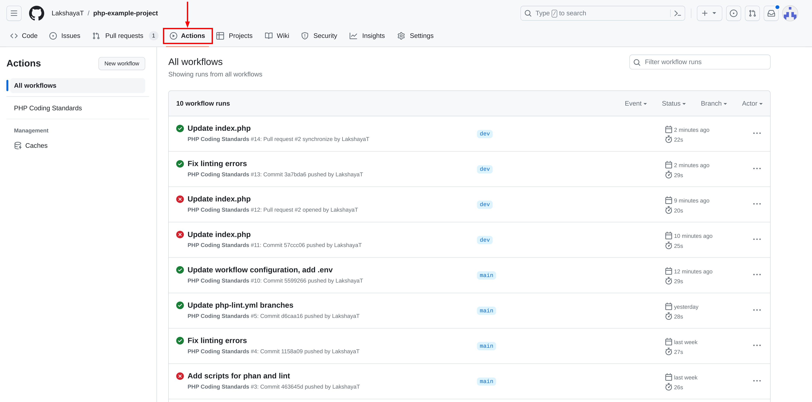

# Continuous Integration (CI) Setup for PHP projects in GitHub

## Table of Contents

1. [Introduction](#1-introduction)
    - [Purpose](#purpose)
    - [Scope](#scope)
2. [Prerequisites](#2-prerequisites)
3. [Setting up Continuous Integration (CI) for PHP Project](#3-setting-up-continuous-integration-ci-for-php-project)
    - [Creating a Workflow File](#creating-a-workflow-file)
        - [Method 1: Using GitHub UI](#method-1-using-github-ui)
        - [Method 2: Manually Creating Workflow File](#method-2-manually-creating-workflow-file)
    - [Assign Name](#assign-name)
    - [Defining `on` Events](#defining-on-events)
    - [Defining Permissions](#defining-permissions)
    - [Writing Job for Linting and Code Analysis](#writing-job-for-linting-and-code-analysis)
    - [Complete Workflow Configuration](#complete-workflow-configuration)
4. [Testing the CI Workflow](#4-testing-the-ci-workflow)
    - [Pushing Changes](#pushing-changes)
    - [Creating Pull Requests](#creating-pull-requests)
    - [Observing Workflow Run](#observing-workflow-run)
5. [Visualizing the CI Process in GitHub](#5-visualizing-the-ci-process-in-github)
    1. [Developer Creates Pull Request/Pushes](#1-developer-creates-pull-requestpushes)
    2. [CI Workflow Initiation](#2-ci-workflow-initiation)
    3. [Job Steps](#3-job-steps)
    4. [Pull Request Integration](#4-pull-request-integration)
6. [Pre-Merge Checks and Bypassing CI Checks](#6-pre-merge-checks-and-bypassing-ci-checks)
7. [Troubleshooting and Advanced Configuration](#7-troubleshooting-and-advanced-configuration)
    - [Handling Merge Conflicts](#handling-merge-conflicts)
    - [Customizing Steps](#customizing-steps)
8. [Sample Repository](#8-sample-repository)
9. [Conclusion](#9-conclusion)
    - [Benefits of CI Setup](#benefits-of-ci-setup)
    - [Future Enhancements](#future-enhancements)

## 1. Introduction

### Purpose

The purpose of this document is to provide a step-by-step guide for setting up a Continuous Integration (CI) workflow for a PHP project in GitHub. The CI workflow will automate the linting and code analysis processes to ensure code quality and reliability.

### Scope

This document covers the basic setup of a CI workflow for a PHP project in GitHub, focusing on linting and code analysis steps. More advanced topics, such as deployment and additional steps, are outside the scope of this guide.

[Back to top](#table-of-contents)

## 2. Prerequisites

- A GitHub account with access to your target repository
- An existing or new repository with the PHP project hosted on GitHub
- All required configurations done as per PHP coding standards' [Enforcing tools and config](https://github.com/OsmosysSoftware/dev-standards/blob/main/coding-standards/php.md#enforcing-tools-and-config)

[Back to top](#table-of-contents)

## 3. Setting up Continuous Integration (CI) for PHP Project

### Creating a Workflow File

#### Method 1: Using GitHub UI

1. Open your project repository and click on the **Actions** tab

    

2. A new page **Choose a workflow** will open, click on the **set up a workflow yourself** link

    

    > Note: In case the project already has some other workflows set up, click on the **New workflow** button on the left side. This will take you to the above page.

3. A new page will open, which will by default create a new file `.github/workflows/main.yml` and allow editing it. For the purposes of this guide, we will rename the file to `php-lint.yml`, though it can be named as seemed fit.

    

4. Follow the steps from [Defining `on` Events](#defining-on-events) and onwards to understand the creation and configuration of this file. Alternatively, paste the configuration in [Complete Workflow Configuration](#complete-workflow-configuration) and make changes as required.

5. Finally, click on the **Commit changes...** button on the right and add the required commit message and description. The file should now be created in the project with the path `.github/workflows/php-lint.yml`.

    

#### Method 2: Manually Creating Workflow File

1. Create or clone the repository on your system. Alternatively, open the repository on GitHub.
2. In the root of your project, create a folder structure `.github/workflows/` if it does not already exist.
3. Inside this folder, add a new file `php-lint.yml`. File can be named as required, but it should be a `.yml` file.
4. Follow the steps from [Defining `on` Events](#defining-on-events) and onwards to understand the creation and configuration of this file. Alternatively, paste the configuration in [Complete Workflow Configuration](#complete-workflow-configuration) and make changes as required.
5. Commit and push this file to the main branch of your repository. The workflow file should now be created in your project.

### Assign Name

Assign a name to your workflow.

```yaml
name: PHP Coding Standards
```

### Defining `on` Events

To automatically trigger a workflow, we use `on` to define which events can cause the workflow to run.

```yaml
on:
  push:
    branches: [ main, dev ]
  pull_request:
    branches: [ main, release ]
```

By specifying the above `on` events, this workflow will run whenever there is a push to the branches 'main' or 'dev', or a Pull Request is created for the branches 'main' or 'release'.

Branches can be added or removed as per the project needs. Addition of new branches can be done as follows:

```yaml
push:
  branches: [ main, dev, feature ]
pull_request:
  branches: [ main, release, dev ]
```

### Defining Permissions

We can use `permissions` to modify the default permissions granted to the `GITHUB_TOKEN`, adding or removing access as required.

For our purposes, performing linting and code analysis can be achieved using just the `contents: read` permission, though this section can be modified as required by the project.

```yaml
permissions:
  contents: read
```

### Writing Job for Linting and Code Analysis

Define the job to perform the linting and code analysis tasks.

```yaml
jobs:
  build:
    runs-on: ubuntu-latest
    steps:
    - name: Checkout app
      uses: actions/checkout@v3

    - name: Cache Composer packages
      id: composer-cache
      uses: actions/cache@v3
      with:
        path: vendor
        key: ${{ runner.os }}-php-${{ hashFiles('**/composer.lock') }}
        restore-keys: |
          ${{ runner.os }}-php-

    - name: Install dependencies
      run: composer install --prefer-dist --no-progress

    - name: Install PHP extensions
      run: sudo apt install php-ast

    - name: Run code quality checks
      run: composer lint

    - name: Run code analysis checks
      run: composer phan
```

### Complete Workflow Configuration

Here is the complete configuration for the `php-lint.yml` workflow file:

```yaml
name: PHP Coding Standards
on:
  push:
    branches: [ main, dev ]
  pull_request:
    branches: [ main, release ]

permissions:
  contents: read

jobs:
  build:
    runs-on: ubuntu-latest
    steps:
    - name: Checkout app
      uses: actions/checkout@v3

    - name: Cache Composer packages
      id: composer-cache
      uses: actions/cache@v3
      with:
        path: vendor
        key: ${{ runner.os }}-php-${{ hashFiles('**/composer.lock') }}
        restore-keys: |
          ${{ runner.os }}-php-

    - name: Install dependencies
      run: composer install --prefer-dist --no-progress

    - name: Install PHP extensions
      run: sudo apt install php-ast

    - name: Run code quality checks
      run: composer lint

    - name: Run code analysis checks
      run: composer phan
```

[Back to top](#table-of-contents)

## 4. Testing the CI Workflow

### Pushing Changes
1. While on the 'main' or 'dev' branch, make changes to your code.
2. Commit and push the made changes to GitHub.

### Creating Pull Requests

1. Create a new branch in your PHP project repository.
2. Make necessary changes to your code and push the branch to GitHub.
3. Create a Pull Request (PR) targeting the 'main' or 'release' branch.

### Observing Workflow Run

1. Navigate to your Pull Request/commit on GitHub.
2. Check and observe the workflow run details for linting and code analysis.
3. Check the job logs for any errors or warnings.
4. Ensure that the workflow status reflects the success or failure of the workflow job.

[Back to top](#table-of-contents)

## 5. Visualizing the CI Process in GitHub

In this section, we will visually explain the Continuous Integration (CI) process in GitHub and how it works for your PHP project.

### 1. Developer Creates Pull Request/Pushes

When a developer works on a feature or bug fix, they create a new branch in the GitHub repository. They then make changes to the code and create a Pull Request (PR) for code review.

Developers may also make pushes to branches that are covered by the `on` event `push` as described in the CI workflow.

### 2. CI Workflow Initiation

Upon PR creation/push, GitHub's CI workflow is automatically triggered. The `php-lint.yml` configuration file you've set up defines the triggers for and jobs to be executed in the workflow.


### 3. Job Steps

The defined steps will install the required dependencies using `composer` and PHP extensions. It then runs the linting process, followed by code analysis on the codebase to check for any coding standards violations or errors.

**If job fails**

- The CI workflow reports issues in the job logs.
- The Pull Request/commit status is updated to indicate that the workflow failed.
- Developers review the errors in the job logs and make necessary code changes and fixes.


**If job succeeds**

- The Pull Request/commit status is updated to indicate that the workflow succeeded.


All the Workflow runs can be seen and reviewed under the **Actions** tab of GitHub:



### 4. Pull Request Integration

The maintainer can now review the workflow results in the Pull Request itself. If the workflow indicates `success`, it signifies that the code adheres to coding standards and no violations or errors were found. This reduces the risk of merging code that may cause errors or disrupt the application.

[Back to top](#table-of-contents)

## 6. Pre-Merge Checks and Bypassing CI Checks

Before merging any changes into the main codebase, it's essential to ensure that the Continuous Integration (CI) checks have been successfully completed. These checks verify that code changes adhere to coding standards, pass tests, and no error is encountered. To enforce this, follow these steps:

1. **Review workflow status**: When a Pull Request (PR) is created or a push is made, monitor the workflow's progress and results. Ensure that the job(s) complete successfully.
2. **Merge only after success**: As a maintainer, it's crucial to enforce the policy of merging changes only when the workflow passes without errors. If the workflow fails, work with the contributor to address the issues before proceeding with the merge.
3. **Bypass workflow check**: In certain scenarios, there may be valid reasons for bypassing the CI checks temporarily. It's recommended that leads add a comment in the PR describing the reason for bypassing the CI checks. This helps maintain a record of the decision and the context behind it.

    Please note that bypassing CI checks should be used sparingly and only in exceptional cases. The goal is to maintain code quality and ensure that the CI process is an integral part of our development workflow.

[Back to top](#table-of-contents)

## 7. Troubleshooting and Advanced Configuration

### Handling Merge Conflicts

If your Pull Request encounters merge conflicts during the auto-merge stage, manual intervention may be required to resolve the conflicts before the workflow can proceed.

### Customizing Steps

Modify the job steps in the `php-lint.yml` file to match your specific linting and code analysis commands and any additional requirements of your PHP project.

[Back to top](#table-of-contents)

## 8. Sample Repository

[Repository Link](https://github.com/OsmosysSoftware/angular-eslint-workflow-guide)

Explore this for practical demonstration of CI setups.

## 9. Conclusion

### Benefits of CI Setup

Setting up a CI workflow for your PHP project offers several benefits:

- Improved code quality through automated linting and code analysis
- Early detection of errors and issues
- Streamlined collaboration through automated testing of Pull Requests and code pushes

### Future Enhancements

Consider enhancing your CI workflow by adding additional jobs and/or steps such as unit testing, integration testing, and deployment to further improve the quality and reliability of your PHP project.

[Back to top](#table-of-contents)
