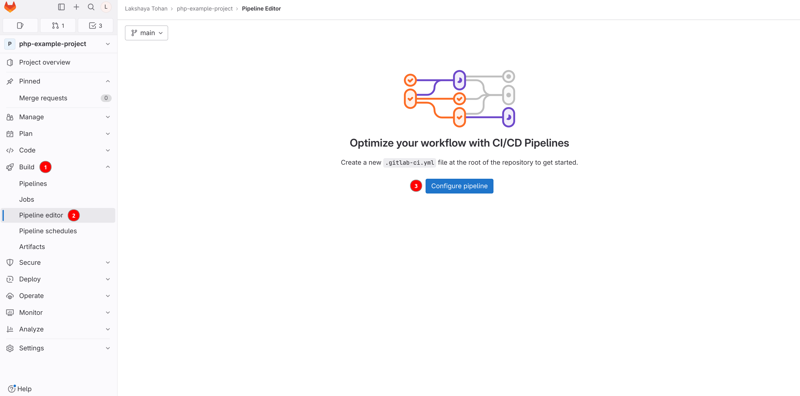
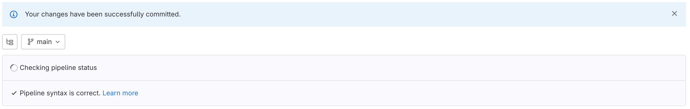
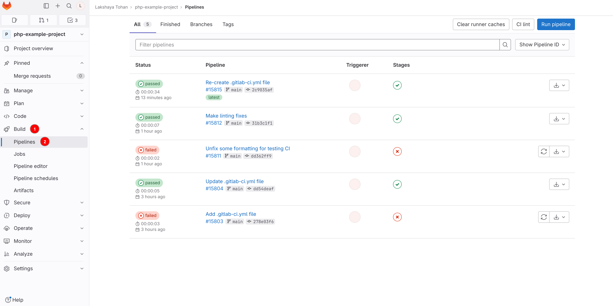
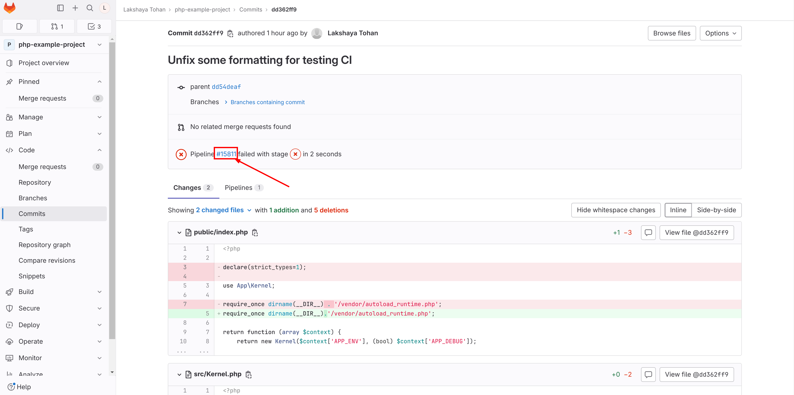
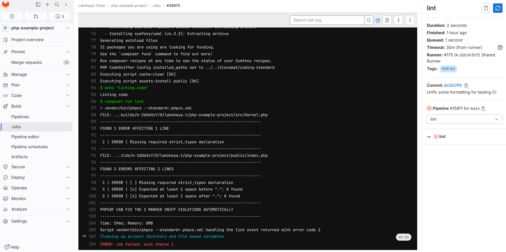
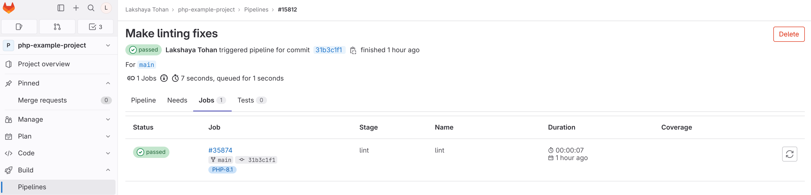

# Setup Continuous Integration (CI) on Gitlab for PHP projects

## Introduction

Continuous Integration (CI) in Gitlab is a software development practice that involves automatically integrating code changes from multiple developers into a shared repository on a frequent and ongoing basis. The main goal of CI is to detect and address integration issues early in the development process, ensuring that code changes are tested, validated, and merged into the main codebase as smoothly as possible.

In Gitlab, a CI/CD Pipeline is a set of automated steps that are executed whenever code changes are pushed to the repository. It consists of jobs that can include tasks like building the code, running tests, or performing standards checks for various programming languages, including PHP.

This page will walk you through the steps for setting up a Gitlab Pipeline for performing PHP coding standards checks with PHPCS and Phan for linting and analysis of code.

## Setting up Gitlab Pipeline for project

### Pre-requisites

- An existing or new repository with the PHP project
- All required configurations done as per [Enforcing tools and config](https://github.com/OsmosysSoftware/dev-standards/blob/main/coding-standards/php.md#enforcing-tools-and-config)

### Creating a Pipeline

GitLab uses a `.gitlab-ci.yml` configuration file in the repository to define the structure and behavior of the CI/CD pipeline. This file specifies the jobs, their dependencies, rules, and scripts to run.

There are two methods that can be followed for creating and configuring a pipeline:

#### Method 1: Using Gitlab UI

1. Open your project repository and click on **Build->Pipeline editor**. Then click on on the **Configure pipeline** button.

    

2. A new page will open for editing and creating the `.gitlab-ci.yml` file. Remove all the content that exists in the file, and paste the following code in its place:

    ```yaml
    stages:
      - lint

    variables:
      push_branches: "/^main|dev$/"
      merge_request_branches: "/^main|release$/"

    lint:
      stage: lint
      tags:
        - PHP-8.1
      rules:
        # Run pipeline if a commit is made to these branches
        - if: $CI_COMMIT_BRANCH =~ $push_branches
        # Run pipeline if a merge request is created for these branches
        - if: $CI_MERGE_REQUEST_TARGET_BRANCH_NAME =~ $merge_request_branches
      script:
        - echo "Installing dependencies"
        - composer install --prefer-dist --no-progress
        - echo "Linting code"
        - composer run lint
        - echo "Running static code analysis"
        - composer run phan
    ```

    Please note that depending on the needs of the projects, the following things can be reconfigured in the above content:

    - ```yaml
      tags:
        - PHP-8.1
      ```

      This value specifies which runner to use for running this pipeline job. It is possible that the value of this may need to be updated in case of multiple runners.

    - ```yaml
      variables:
        push_branches: "/^main|dev$/"
        merge_request_branches: "/^main|release$/"
      ```

      This section defines regex patterns for the names of the branches for push or merge requests for which the job should run. In its current state, this job will run only when the commit branch is 'main' or 'dev' (i.e., a commit is made to the 'main' or 'dev' branch), or a merge request is created for the 'main' or 'release' branch.

      In order to add more branches, it can done as follows:

      ```yaml
      variables:
        push_branches: "/^main|dev|feature$/"
        merge_request_branches: "/^main|release|dev$/"
      ```

      This regex is evaluated as follows:
      - If the commit branch matches 'main' or 'dev' or 'feature', run the job.
      - If a merge request is created and target branch is 'main' or 'release' or 'dev', run the job.

      While adding new branch names, it should be kept in mind that the names will be evaluated in a regex pattern, and as such, escaping of any required characters should be done.

3. Add or edit the commit message, choose the main branch of your project and click on **Commit changes**. You should get a banner message like follows to signify that the file has been created successfully.

    

    The creation of this `.gitlab-ci.yml` file can also be verified by checking in the root of the project.

#### Method 2: Manually creating pipeline file

1. Create or clone the repository on your system.
2. In the root of your project, create a file `.gitlab-ci.yml`.
3. Add the same content as mentioned in step 2 of [Method 1: Using Gitlab UI](#method-1-using-gitlab-ui) above to this file. Make changes as required.
4. Commit and push this file to the main branch of your repository. The workflow file should now be created in your project.

### Verifying the pipeline

After following the steps for creating a new pipeline, you can verify if the pipeline is running as expected or not. For this, follow the below mentioned steps:

1. Open your project repository and click on **Build->Pipelines**. This should open a page as follows:

    

2. Click on any of the listed pipeline to view details about commit or merge request for which it was executed.

    Click on the Pipeline `#<number>` to view further details about the pipeline such as the Jobs run. This can also be directly opened from the main Pipelines page.

    

3. Click on a Job to view complete details about where the execution has failed for a `failed` pipeline. This information can be used to perform required fixes.

    

4. Upon performing the needed fixes, the pipeline  status should be `passed` after the jobs have been run.

    
