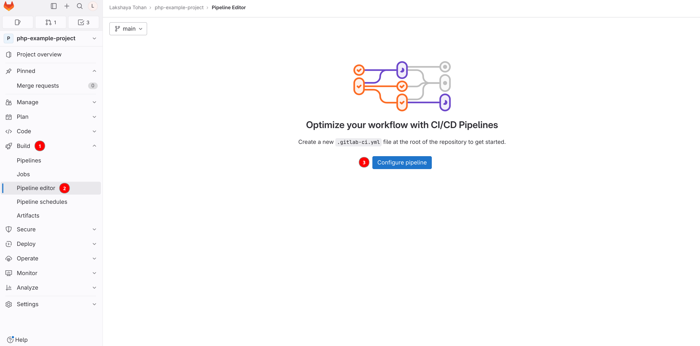
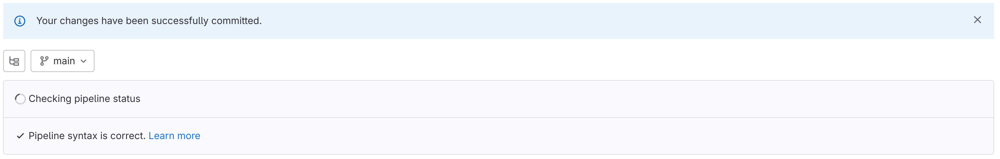
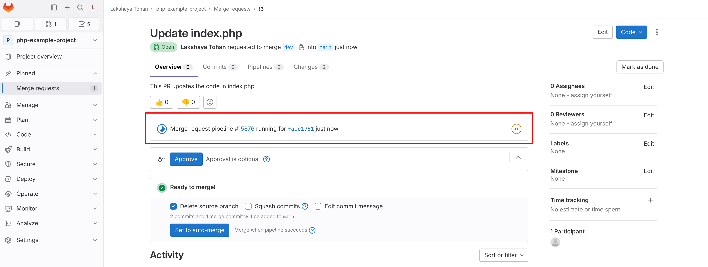
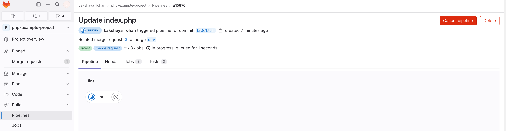
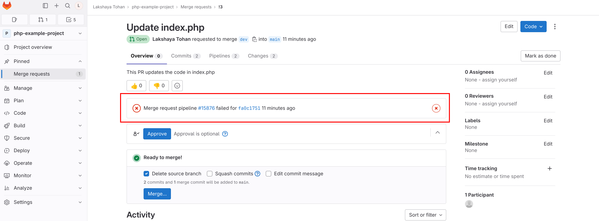
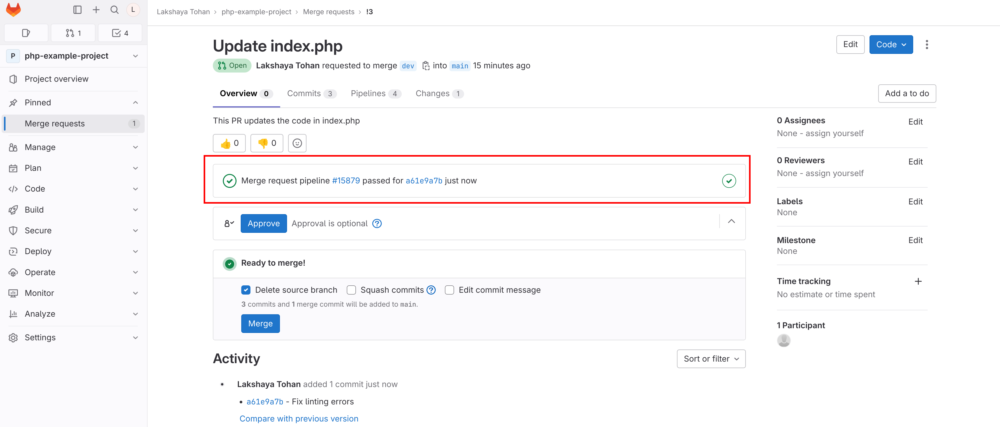
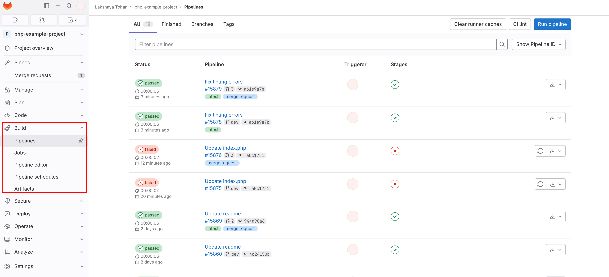

# Continuous Integration (CI) Setup for PHP projects in Gitlab

## Table of Contents

1. [Introduction](#1-introduction)
    - [Purpose](#purpose)
    - [Scope](#scope)
2. [Prerequisites](#2-prerequisites)
3. [Setting up Continuous Integration (CI) for PHP Project](#3-setting-up-continuous-integration-ci-for-php-project)
    - [Creating a `.gitlab-ci.yml` File](#creating-a-gitlab-ciyml-file)
        - [Method 1: Using Gitlab UI](#method-1-using-gitlab-ui)
        - [Method 2: Manually Creating Pipeline File](#method-2-manually-creating-pipeline-file)
    - [Defining Stages](#defining-stages)
    - [Defining Variables](#defining-variables)
    - [Writing Job for Lint](#writing-job-for-lint)
    - [Complete `.gitlab-ci.yml` Configuration](#complete-gitlab-ciyml-configuration)
4. [Testing the CI Pipeline](#4-testing-the-ci-pipeline)
    - [Making Commits](#making-commits)
    - [Creating Merge Requests](#creating-merge-requests)
    - [Observing Pipeline Execution](#observing-pipeline-execution)
5. [Visualizing the CI Process in Gitlab](#5-visualizing-the-ci-process-in-gitlab)
    1. [Developer Creates Merge Request/Commit](#1-developer-creates-merge-requestcommit)
    2. [CI Pipeline Initiation](#2-ci-pipeline-initiation)
    3. [Job Stages](#3-job-stages)
    4. [Merge Request Integration](#4-merge-request-integration)
6. [Pre-Merge Checks and Bypassing CI Checks](#6-pre-merge-checks-and-bypassing-ci-checks)
7. [Troubleshooting and Advanced Configuration](#7-troubleshooting-and-advanced-configuration)
    - [Handling Merge Conflicts](#handling-merge-conflicts)
    - [Customizing Scripts](#customizing-scripts)
8. [Conclusion](#8-conclusion)
    - [Benefits of CI Setup](#benefits-of-ci-setup)
    - [Future Enhancements](#future-enhancements)

## 1. Introduction

### Purpose

The purpose of this document is to provide a step-by-step guide for setting up a Continuous Integration (CI) pipeline for PHP project in GitLab. The CI pipeline will automate the linting and code analysis processes to ensure code quality and reliability.

### Scope

This document covers the basic setup of a CI pipeline for a PHP project in GitLab, focusing on linting and code analysis stage. More advanced topics, such as deployment and additional stages, are outside the scope of this guide.

[Back to top](#table-of-contents)

## 2. Prerequisites

Before setting up the CI pipeline, ensure you have the following prerequisites:

- A GitLab account with access to your target repository
- An existing or new repository with the PHP project hosted on Gitlab
- All required configurations done as per PHP coding standards' [Enforcing tools and config](https://github.com/OsmosysSoftware/dev-standards/blob/main/coding-standards/php.md#enforcing-tools-and-config)

[Back to top](#table-of-contents)

## 3. Setting up Continuous Integration (CI) for PHP Project

### Creating a `.gitlab-ci.yml` File

#### Method 1: Using Gitlab UI

1. Open your project repository and click on **Build->Pipeline editor**. Then click on on the **Configure pipeline** button.

    

2. A new page will open for editing and creating the `.gitlab-ci.yml` file. Remove all the content that exists in the file.

3. Follow the steps from [Defining Stages](#defining-stages) and onwards to understand the creation and configuration of this file. Alternatively, paste the configuration in [Complete `.gitlab-ci.yml` Configuration](#complete-gitlab-ciyml-configuration) and make changes as required.

4. Add or edit the commit message, choose the main branch of your project and click on **Commit changes**. You should get a banner message like follows to signify that the file has been created successfully.

    

    The creation of this `.gitlab-ci.yml` file can also be verified by checking in the root of the project.

#### Method 2: Manually Creating Pipeline File

1. Create or clone the repository on your system. Alternatively, open the repository on Gitlab.
2. In the root of your project, create a file `.gitlab-ci.yml` and open it.
3. Follow the steps from [Defining Stages](#defining-stages) and onwards to understand the creation and configuration of this file. Alternatively, paste the configuration in [Complete `.gitlab-ci.yml` Configuration](#complete-gitlab-ciyml-configuration) and make changes as required.
4. Commit and push this file to the main branch of your repository. The workflow file should now be created in your project.

### Defining Stages

Define the stages for your CI pipeline. In this guide, we will use one stage: `lint`.

```yaml
stages:
  - lint
```

### Defining Variables

Define variables that specify the branches on which you want to execute your CI job.

```yaml
variables:
  push_branches: "/^main|dev$/"
  merge_request_branches: "/^main|release$/"
```

These variables define regex patterns for the names of the branches for push or merge requests for which the job should run. In its current state, this job will run only when the commit branch is 'main' or 'dev' (i.e., a commit is made to the 'main' or 'dev' branch), or a merge request is created for the 'main' or 'release' branch.

In order to add more branches, it can be done as follows:

```yaml
variables:
  push_branches: "/^main|dev|feature$/"
  merge_request_branches: "/^main|release|dev$/"
```

This regex is evaluated as follows in the `rules` section of the job (see [Writing Job for Lint](#writing-job-for-lint)):
- If the commit branch matches 'main' or 'dev' or 'feature', run the job.
- If a merge request is created and target branch is 'main' or 'release' or 'dev', run the job.

While adding new branch names, it should be kept in mind that the names will be evaluated in a regex pattern, and as such, escaping of any required characters should be done.

### Writing Job for Lint

Create the job to perform the linting and code analysis tasks.

```yaml
lint:
  stage: lint
  tags:
    - PHP-8.1
  rules:
    # Run pipeline if a commit is made to these branches
    - if: $CI_COMMIT_BRANCH =~ $push_branches
    # Run pipeline if a merge request is created for these branches
    - if: $CI_MERGE_REQUEST_TARGET_BRANCH_NAME =~ $merge_request_branches
  script:
    - echo "Installing dependencies"
    - composer install --prefer-dist --no-progress
    - echo "Linting code"
    - composer run lint
    - echo "Running static code analysis"
    - composer run phan
```

In the above job, note that we also define the following two things:

- ```yaml
  tags:
    - PHP-8.1
  ```

  This value specifies which runner to use for running this pipeline job. It is possible that the value of this may need to be updated in case of multiple runners.

- ```yaml
    rules:
    # Run pipeline if a commit is made to these branches
    - if: $CI_COMMIT_BRANCH =~ $push_branches
    # Run pipeline if a merge request is created for these branches
    - if: $CI_MERGE_REQUEST_TARGET_BRANCH_NAME =~ $merge_request_branches
  ```

  This section defines `rules` that must be met in order for this job to run. Rules have been defined to run this job in case the commit branch names or merge request target branch names match the names in regex patterns in respective variables as defined in [Defining Variables](#defining-variables) above.

### Complete `.gitlab-ci.yml` Configuration

Here is the complete configuration for the `.gitlab-ci.yml` file:

```yaml
stages:
  - lint

variables:
  push_branches: "/^main|dev$/"
  merge_request_branches: "/^main|release$/"

lint:
  stage: lint
  tags:
    - PHP-8.1
  rules:
    # Run pipeline if a commit is made to these branches
    - if: $CI_COMMIT_BRANCH =~ $push_branches
    # Run pipeline if a merge request is created for these branches
    - if: $CI_MERGE_REQUEST_TARGET_BRANCH_NAME =~ $merge_request_branches
  script:
    - echo "Installing dependencies"
    - composer install --prefer-dist --no-progress
    - echo "Linting code"
    - composer run lint
    - echo "Running static code analysis"
    - composer run phan
```

[Back to top](#table-of-contents)

## 4. Testing the CI Pipeline

### Making Commits
1. While on the 'main' or 'dev' branch, make changes to your code.
2. Commit and push the made changes to Gitlab.

### Creating Merge Requests

1. Create a new branch in your PHP project repository.
2. Make changes to your code and push the branch to GitLab.
3. Create a merge request (MR) targeting the 'main' or 'release' branch.

### Observing Pipeline Execution

1. Navigate to your Merge Request/commit on GitLab.
2. Observe the pipeline execution as it runs the `lint` stage.
3. Check the job logs for any errors or warnings.
4. Ensure that the pipeline status reflects the success or failure of the `lint` stage.

[Back to top](#table-of-contents)

## 5. Visualizing the CI Process in Gitlab

In this section, we will visually explain the Continuous Integration (CI) process in GitLab and how it works for your PHP project.

### 1. Developer Creates Merge Request/Commit

When a developer works on a feature or bug fix, they create a new branch in the GitLab repository. They then make changes to the code and create a Merge Request (MR) for code review.

Developers may also make commits to branches that are covered by the `rules` as described in the CI pipeline.

### 2. CI Pipeline Initiation

Upon MR creation/commit, GitLab's CI pipeline is automatically triggered. The `.gitlab-ci.yml` configuration file you've set up defines the stages and jobs to be executed in the pipeline. In our case, there is only one stage, `lint`.



### 3. Job Stages

The `lint` stage will install the required dependencies using `composer`. It then runs the linting process, followed by code analysis on the codebase to check for any coding standards violations or errors.



**If `lint` fails**

- The CI pipeline reports issues in the job logs.
- The Merge Request/commit status is updated to indicate that the pipeline failed.
- Developers review the errors in the job logs and make necessary code changes and fixes.



**If `lint` passes**

- The Merge Request/commit status is updated to indicate that the pipeline passed.



All the Pipelines and Jobs can be seen and reviewed under the **Build** menu of gitlab:



### 4. Merge Request Integration

The maintainer can now review the `lint` results in the Merge Request itself. If the pipeline indicates `passed`, it signifies that the code adheres to coding standards and no violations or errors were found. This reduces the risk of merging code that may cause errors or disrupt the application.

[Back to top](#table-of-contents)

## 6. Pre-Merge Checks and Bypassing CI Checks

Before merging any changes into the main codebase, it's essential to ensure that the Continuous Integration (CI) checks have been successfully completed. These checks verify that code changes adhere to coding standards, pass tests, and no error is encountered. To enforce this, follow these steps:

1. **Review pipeline status**: When a Merge Request (MR) is created or a commit is made, monitor the pipeline's progress and results. Ensure that all stages, such as `lint`, complete successfully.
2. **Merge only after success**: As a maintainer, it's crucial to enforce the policy of merging changes only when the pipeline passes without errors. If the pipeline fails, work with the contributor to address the issues before proceeding with the merge.
3. **Bypass pipeline check**: In certain scenarios, there may be valid reasons for bypassing the CI checks temporarily. It's recommended that leads add a comment in the MR describing the reason for bypassing the CI checks. This helps maintain a record of the decision and the context behind it.

    Please note that bypassing CI checks should be used sparingly and only in exceptional cases. The goal is to maintain code quality and ensure that the CI process is an integral part of our development workflow.

[Back to top](#table-of-contents)

## 7. Troubleshooting and Advanced Configuration

### Handling Merge Conflicts

If your Merge Request encounters Merge Conflicts during the auto-merge stage, manual intervention may be required to resolve the conflicts before the pipeline can proceed.

### Customizing Scripts

Modify the script in the `.gitlab-ci.yml` file to match your specific linting and code analysis commands and any additional requirements of your PHP project.

[Back to top](#table-of-contents)

## 8. Conclusion

### Benefits of CI Setup

Setting up a CI pipeline for your PHP project offers several benefits:

- Improved code quality through automated linting and code analysis
- Early detection of errors and issues
- Streamlined collaboration through automated testing of Merge Requests and commits

### Future Enhancements

Consider enhancing your CI pipeline by adding additional stages such as unit testing, integration testing, and deployment to further improve the quality and reliability of your PHP project.

[Back to top](#table-of-contents)
