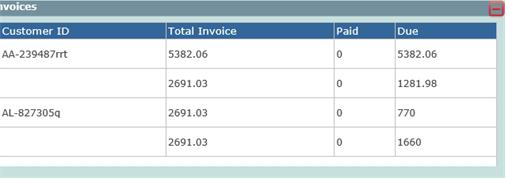

# UI Standards

| Sno | Element                           | Sub Element              | Behaviour                                                                                                                                                                                                                                                                                                                                                             |
| :--- | :--------------------------------- | :------------------------ | :--------------------------------------------------------------------------------------------------------------------------------------------------------------------------------------------------------------------------------------------------------------------------------------------------------------------------------------------------------------------- |
| 1   | Alignment                         | Design                   | While creating components in an app, make sure they align well from a UI perspective.                                                                                                                                                                                                                                                                                 |
| 2   | Bulk import                       | Import process           | Bulk import (users or anything) should be done asynchronously in the background. We cannot hold the UI / portal / user waiting for a long time while import is happening.                                                                                                                                                                                            |
| 3   | Button                            | Field positioning        | By default - the save / cancel / ok buttons must be on the right side bottom (unless explicitly mentioned)                                                                                                                                                                                                                                                            |
| 4   | Button, Link, Icon                | Design                   | Often, client systems are slow - and some clients are still used to double clicking buttons. Therefore, always put the logic inside the buttons in such a way that, once it is clicked, it does NOT take the second click unless the process is completed. You can incorporate the loading symbol as soon as the first click is made.                                 |
| 5   | Button, Link, Icon                | Interactive              | Providing clear visual cues for interactive elements like buttons and links helps users easily identify and understand their purpose.     Example: Provide visual feedback when users hover over or click on a button. This can be achieved through color changes, shadows, or animations.                                                                      |
| 6   | Color                             | Design                   | The color combination should be uniform and neat. Always ask what colors are acceptable. Refer to the project Initiation document for the acceptable colors.                                                                                                                                                                                                          |
| 7   | Data testing                      | Data                     | The best way to test any text field is to go to Wikipedia, pick a paragraph for any item, copy & paste it. Since usually the Wikipedia content has hyperlinks and has a large text, this will allow you to understand if the field is doing the correct validations.                                                                                                 |
| 8   | Data testing                      | Data                     | Even in your testing, use sensible data. Putting XYZ, A1, A2 3fhjfd for names, giving irrelevant addresses do not look good even for internal people. You can maintain one excel with sensible data and use it for the purpose of filling it in                                                                                                                       |
| 9   | Date & Time display               | Show in user's timezone  | Always show times in user's local timezone and you should inform that somewhere to the user that all times you see are in local timezone.                                                                                                                                                                                                                             |
| 10  | Date & Time display               | Format                   | Ensure all date fields are of the SAME Format.  This is usually based on the country of the client.  And the date storage has to be in UTC and it has to be converted locally based on the local system time                                                                                                                                                    |
| 11  | Date & Time display               | Validation               | Check if previous dates & future dates are allowed in selection.  If From & To dates are being selected - the To Date cannot be older than the From Date.   Based on the functionality, both the From & To dates may not be into the future                                                                                                                     |
| 12  | Date & Time display               | display                  | Time should be taken from DB and show according to the local time of the system browser is using (That way - UK person sees in UK time while India person sees in India time)                                                                                                                                                                                         |
| 13  | Delete Button                     | Confirmation             | For Every Delete option - ensure you are throwing a POPUP and getting confirmation from the client.. The message should be "You are deleting<< data>>, are you sure?"                                                                                                                                                                                                 |
| 14  | Dialogs                           | Limit the usage          | Use modal dialogs sparingly, reserving them for important or critical interactions. Overuse of modals can disrupt the user's workflow and make the interface feel cumbersome.                                                                                                                                                                                         |
| 15  | Dropdown Field                    | Decision                 | If for a radio button there are more than 3 options then it is always better to use a dropdown instead of radio button.                                                                                                                                                                                                                                               |
| 16  | Dropdown Field                    | Sorting                  | Always sort alphabetical unless specified otherwise.                                                                                                                                                                                                                                                                                                                  |
| 17  | Dropdown Field                    | Multiselect              | All multiselect dropdowns should have options to select all or unselect all.                                                                                                                                                                                                                                                                                          |
| 18  | Error / warning messages          | Configuration            | All Error / warning / information messages MUST come from a configuration file that can be easily changed without having to make any program changes.    Provide clear and meaningful error messages to help users understand and resolve issues.                                                                                                               |
| 19  | Export Data                       | Exporting CSV            | When an export is done with a Grid, only export the data that is shown in the grid for that selected filter options. Export all pages data for that filter option irrespective of the pagination.                                                                                                                                                                     |
| 20  | Field alignments                  |                          | Following field alignments are important  Label alignments - all labels must be left aligned and appear properly under each other  All input fields must be aligned properly - same size fields must have left alignment                                                                                                                                        |
| 21  | Field Size                        | Visibility               | If we are giving an email - making the field size only show 10 characters is bad, Similarly - Description / comments / details field must always have multiple lines.  If the field content is going to be more than what is visible, then scroll bars must automatically appear. This is more for descriptions, comments, remarks etc                             |
| 22  | Field Size                        | As per standard document | We need a document - that states what are the default sizes for each type of field -- name, email id, Record ID, Date, description, Subject etc                                                                                                                                                                                                                       |
| 23  | Field Size                        | Size                     | For all fields like description, copy a large text from wikipedia and paste it here.. the error should be proper so the user understands the mistake - if the text is beyond limit                                                                                                                                                                                    |
| 24  | Fields in Grid                    | Alignment                | All fields (Except Money & Numbers) Preferably aligned Left or center based on the UI                                                                                                                                                                                                                                                                                 |
| 25  | File upload                       |                          | Never allow .exe or .bin kind of files to be uploaded. Unless the client has given clear instructions - stick to PDF and images                                                                                                                                                                                                                                       |
| 26  | Follow platform design guidelines | Component styling        | If designing for specific platforms (such as iOS or Android), adhere to the platform's design guidelines to ensure consistency and familiarity for users. This includes using platform-specific icons, navigation patterns, and UI components.                                                                                                                        |
| 27  | Fonts                             | Uniformity               | Ensure that all fields in one form and across the application are using uniform fonts.                                                                                                                                                                                                                                                                                |
| 28  | Fonts                             | Design                   | Have a standardized set of fonts for different elements of a page/application. The fonts must be taken from the Project Initiation document.                                                                                                                                                                                                                       |
| 29  | Footer                            | Version and copyright    | Always have version number and copy right text in the footer. Make sure copy right year is NOT hardcoded.                                                                                                                                                                                                                                                             |
| 30  | Form grouping                     | Layout                   | Arrange form fields logically, grouping related fields together. Consider using multi-column layouts for longer forms to reduce vertical scrolling.                                                                                                                                                                                                                   |
| 31  | Forms                             | Validations              | Ensure all form fields have proper validation and provide helpful error messages for invalid inputs.                                                                                                                                                                                                                                                                  |
| 32  | Forms                             | Design                   | Every form MUST have an option to exit. The X button on the right top is NOT sufficient                                                                                                                                                                                                                                                                               |
| 33  | Forms                             | Mandatory fields         | All mandatory should have an indication that they are mandatory to submit a form.  If submitted without filling some of the mandatory fields - all missing felids should be highlighted in a color so its clearly visible to the user                                                                                                                              |
| 34  | Forms                             | Reset                    | Always keep an option for the user to reset all filled fields on the form.                                                                                                                                                                                                                                                                                            |
| 35  | Forms                             | Submit                   | After a successful form submit, please clear all the fields.                                                                                                                                                                                                                                                                                                          |
| 36  | Forms                             | Labels                   | Align label text to the left                                                                                                                                                                                                                                                                                                                                          |
| 37  | Forms                             | Country code             | Don't merge phone number and country code fields into one single field. Allow the user to first pick country and then enter the phone number.                                                                                                                                                                                                                         |
| 38  | Forms                             | Captcha                  | Any form which is public (do not require authentication) then always try to add a captcha. They prevent spam from automated programs                                                                                                                                                                                                                                  |
| 39  | Forms                             | Navigation               | Enable the ability to tab to next form field. This allow visitors to use the tab key on your forms so they can move to the next form field without lifting their hands off of their keyboards.                                                                                                                                                                        |
| 40  | Forms                             | Progress bar             | If there is a very long form, then identify fields which can be grouped together as a section and then allow user to fill one section at a time by adding a progress bars for long forms.    ex: https://shorturl.at/DFKY5                                                                                                                                      |
| 41  | Forms                             | Password confirmation    | Don’t ask for password confirmation    Asking for password confirmation increases the complexity of the sign-up process. Instead, an option to show the password fulfills the purpose with much ease.                                                                                                                                                           |
| 42  | Forms                             | Caps                     | Indicate the caps lock option    Indicating the Caps Lock state helps to set the users’ expectations. This is not a really very important to have it always but adds value to customer experience.                                                                                                                                                              |
| 43  | Forms                             | Validations              | Provide instant input validation    Instant input validation allows the users to correct their errors instantly. The users do not have to wait to submit the form to see any errors that need their attention.                                                                                                                                                  |
| 44  | Forms                             | Navigation               | Allow switching between login and sign-up.    It’s quite common to switch to the login page when the user is currently on the sign-up page.                                                                                                                                                                                                                     |
| 45  | Forms                             | Password                 | Indicate clearly why the password is invalid. The error message should clearly indicate why the entered password is invalid.                                                                                                                                                                                                                                          |
| 46  | Forms                             | Forgot password          | Allow easy password recovery.    Presenting the Forgot Password option just along with the Login button helps users find it easily.                                                                                                                                                                                                                             |
| 47  | Forms                             | Remember me              | Make login easier by providing remember me option. An explicit Remember me option confirms the users’ opinion about saving their information for the next login.    This is very common across all web applications.                                                                                                                                            |
| 48  | Forms                             | Submit                   | Show a clear indication using a toast message or some element to represent that the form is submitted.    ex: Showing a toast message that "Employee data updated successfully"                                                                                                                                                                                 |
| 49  | Graphs                            | Display                  | Any graphs used should be responsive and appear in 100% resolution, should NOT look compressed.                                                                                                                                                                                                                                                                       |
| 50  | Grid / Table                      | Sorting                  | Make sure you disable sorting on some columns where it's not applicable, for ex - Actions column where you will have edit/delete buttons                                                                                                                                                                                                                              |
| 51  | Grid / Table                      | Searching                | Search box placeholder should contain the column names considered for searching.  And / Or, we can put a small ? next to it - that opens a popup on how the search is working                                                                                                                                                                                      |
| 52  | Grid / Table                      | Pagination               | Always decide whether you want to have client side pagination/server side pagination before you start implementing.    Prefer server side pagination if you know that records will be more than 30-40.                                                                                                                                                          |
| 53  | Grid / Table                      | Columns                  | If you have more than 6-7 columns, it's best that you always have a column selector control.                                                                                                                                                                                                                                                                          |
| 54  | Grid / Table                      | Columns                  | Don't show IDs in the datatable which are unique IDs in the database. If you have any other custom unique ID for each record you can show that. Showing database table ID doesn't make sense to the end users                                                                                                                                                         |
| 55  | Grid / Table                      | Entries                  | Allow the user to see the number of entries in a page.    ex: By default we might want to show 10 entires but allow user to have the ability to select 20, 50 or even 100 records.                                                                                                                                                                              |
| 56  | Grid / Table                      | Data                     | When there are no records to be shown for a table or datatable, then always show a message to indicate that there are no records.    ex: Showing empty table or no table in such cases will create confusion to the user.                                                                                                                                       |
| 57  | Grid / Table                      | Save datatable state     | Remembering datatable state is important for better UX, If user searches for a specific record in a specific page, opens a record and comes back to this page, user should still see the same page instead of 1st page of table.                                                                                                                                      |
| 58  | Grid / Table                      | Info                     | After adding new item to the system, grid should automatically refresh showing the new item.                                                                                                                                                                                                                                                                          |
| 59  | Grid / Table                      | Default Order            | Show it in Name sorted - unless specified  The other option is to show the latest record on top.                                                                                                                                                                                                                                                                   |
| 60  | Grid / Table                      | Column Order             | Ensure all grids of same type show the same orders (Name, email, phone number etc)  This has to be ensured across all pages of the application.  Its awkward to have one table starting with serial number and another table starting with date                                                                                                                 |
| 61  | Grid / Table                      | Loading                  | Lazy loading? or normal loading - do we get all pages data once and show. - or get data every time a page is clicked?                                                                                                                                                                                                                                                 |
| 62  | Grid / Table                      | Pagination               | Default size of the grid in terms of records - how does pagination work etc                                                                                                                                                                                                                                                                                           |
| 63  | Info                              | Info                     | Not always but in most cases it is recommended to show the application version.   Can be placed in footer.                                                                                                                                                                                                                                                         |
| 64  | Lazy loading                      | Large sets of data       | Implement lazy loading when there is a large set of data.  Implement lazy loading techniques for images and non-critical data.                                                                                                                                                                                                                                     |
| 65  | Loading symbol (Spinner)          | Design                   | By default, in all pages loading use the Loading symbol (on submit buttons)                                                                                                                                                                                                                                                                                           |
| 66  | Loading time                      | Optimization             | Aim to create a UI that loads quickly and provides a smooth user experience. Optimize assets, minimize unnecessary network requests. If it takes more than 2 seconds for all page loading & data rendering, that is UNACCEPTABLE.                                                                                                                                     |
| 67  | Minimize user input               | Data                     | Reduce the amount of manual data entry required from users. Utilize autocomplete, dropdowns, and pre-filled fields wherever possible to simplify the input process and minimize errors.                                                                                                                                                                               |
| 68  | Money & Numbers                   | Alignment                | Money columns or number columns MUST always be right aligned.  Money fields must always have two decimal points  Even if the money field is NOT in a table, it must always be right aligned.                                                                                                                                                                    |
| 69  | Money & Numbers                   | format                   | If decimals are used... 100.00, 199.99 then all fields MUST have two decimal points.. It cannot be 199.99 and 100. (Even 100 must be shown as 100.00)                                                                                                                                                                                                                 |
| 70  | No of APIs per page               | speed                    | Though there is no fixed number, keep an eye on this to ensure that the overall speed of the page rendering is not more than 2 seconds.                                                                                                                                                                                                                               |
| 71  | Phone number                      | Validation               | Never allow text in phone numbers field. if the field is taking multiple phone numbers, ensure there is a tool tip or help text that is making it clear if comma has to be used.. and do proper validations                                                                                                                                                           |
| 72  | Tooltips                          | Clarity                  | Include tooltips or help text near complex or unfamiliar UI elements to provide additional context or guidance. Clear explanations can help users understand functionality or actions better. Putting a tool tip on Name field and saying "Enter name" is ridiculous                                                                                                  |
| 73  | Responsive                        | UI Responsiveness        | Every UI developed must be tested in multiple resolutions. And today, most web pages are also visible in mobile - so the UI developed must elegantly fit into a mobile.                                                                                                                                                                                               |
| 74  | Scroll bars                       | Design                   | Never use both horizontal & Vertical scroll bars.                                                                                                                                                                                                                                                                                                                     |
| 75  | Scroll bars                       | Design                   | Ensure that when the scroll bar comes up, it is NOT covering any data.                                                                                                                                                                                                                                                                                                |
| 76  | Spellings                         | Correctness              | Ensure all field labels are correct spelling & Uniform spellings.  Use Google to double check your spellings                                                                                                                                                                                                                                                       |
| 77  | Tab movement                      | Navigation               | The field movement when TAB is used should be proper. It should NOT be jumping all over the page. Make it on the order your fields are placed                                                                                                                                                                                                                         |
| 78  | Text inputs                       | Info                     | Add placeholders to give information about the field if possible                                                                                                                                                                                                                                                                                                      |
| 79  | Text/labels                       | Case                     | Follow sentence case through out the application (First letter of the word/sentence is capital, rest all small - for ex: First name, Last name, Please fill mandatory details etc)    Follow title case ONLY if it's specifically asked by the client( Ex: First Name, Last Name etc)    But whatever you follow it should be same across the application |
| 80  | Themes                            |                          | If themes are being used - check everything in each theme - especially dropdowns                                                                                                                                                                                                                                                                                      |
| 81  | Upload button                     | Info                     | Give(Show) information about what formats / extensions are allowed and what is the maximum size allowed                                                                                                                                                                                                                                                               |
| 82  | White space                       | Design                   | White space (or negative space) is an important design element that can be used to improve readability and create a sense of balance in the UI. So always use white space effectively.                                                                                                                                                                                |
# Fields

## Names

Field names or Labels are what helps the user understand which data goes where. Giving the correct & comprehensible labels is very essential for a good user interface. While most of them appear simple & straight forward, maintaining uniformity and correctness is important.  For example, Name & Full Name actually might mean the same thing while explicitly asking for First Name, Middle Name and Last Name makes it extremely clear.

And when a single field has to be used, it is better to use Full Name instead of just Name. Maintaining the same label across all forms is very important. 

Comments, Remarks, Notes are another set of labels are mixed up often and confuse the client. Whatever is chosen shall be maintained same across the application.

One of the common mistakes noticed is to have names appear in camel notation. For ex, ExpectedTime instead of writing Expected time. This is prominently noticed in grids when the data table binding happens. This shall be avoided and names written clearly with appropriate spaces.

## Alignments

Fields are aligned horizontally and vertically.  In addition to alignment, the spacing between fields both horizontally and vertically is important. 

**Label Vertical alignment** – all labels must be either top aligned or center aligned. Osmosys by default uses top alignment.

**Label Horizontal alignment** – all labels must be either left aligned or right aligned. Osmosys by default uses left alignment.

**Label / Field Vertical spacing** - This is the space between two fields in the same column. It is very important to maintain this same across all fields in the page & application.

|                            | Osmosys Default |
| -------------------------- | --------------- |
| Label Vertical Alignment   | Top             |
| Label Horizontal Alignment | Left            |
| Label Font Type            |                 |
| Label Font Size            |                 |
 
## Sizes

Proper field sizes are essential for comfortable data entry and good appearance of the user interface. Following points are to be kept in serious consideration while designing user interfaces:

1. **Relevance:** Proper size for each field is important for a good user experience. An email with 50 characters shall have the field width to accommodate that size. Similarly, the field for Age can have a size that takes 3 characters. If we are  taking notes or comments, then that fields should reflect 
2. **Uniformity:** All fields of the same type in a form / application shall have the same size. This is properly achieved when we follow a well designed CSS. The same proper sizing shall be followed even in grids.

The above image shows three different column widths for the same data type (money) – such  things  shall  be  avoided,  unless explicitly asked by the client.

## Properties

This document describes the various type of fields and their properties.

| Use                                      | DB DataType                    | DB Length      | Max Length (UI)      | Min Length (UI) | Alignment | Allowed Characters                               | Comments                                                                                                                             |
| ---------------------------------------- | ------------------------------ | -------------- | -------------------- | --------------- | --------- | ------------------------------------------------ | ------------------------------------------------------------------------------------------------------------------------------------ |
| Normal Text (FirstName, LastName etc...) | Varchar                        | 50             | 50                   | 2               | Left      | Alphanumeric including special characters        | The control must be like that the user must be able to see at least 30 characters in the textbox.                                    |
| Email / URL                              | Varchar                        | 256            | 256                  | 2               | Left      | Alphanumeric including special characters        | The control must be like that the user must be able to see at least 30 characters in the textbox.                                    |
| Age                                      | Int                            | 3              | 3                    | 1               | Left      | Only numbers                                     |                                                                                                                                      |
| Postal Code / Zip Code                   | Varchar                        | 10             | 10                   | 3               | Left      | Alphanumeric including space and hyphen(-)       |                                                                                                                                      |
| Phone Number                             | Varchar                        | 15             | 15                   | 10              | Left      | Numbers with (, -, + and space should be allowed | Can vary from project to project.                                                                                                    |
| Fax Number                               | Varchar                        | 15             | 15                   | 10              | Left      | Numbers with (, -, + and space should be allowed | Can vary from project to project.                                                                                                    |
| Description / Address                    | Varchar (if size > 1000, Text) | 1000           | 1000                 |                 | Left      | Alphanumeric including special characters        | Can vary from project to project. The control must be like that the user must be able to see at least 200 characters in the textbox. |
| Amounts or Totals (Money)                | Decimal                        | (18,2) Default | 21                   |                 | Right     | Decimal numbers with precision 2                 | Can vary from project to project. Must be right aligned.                                                                             |
| Password                                 | Varchar                        | 25             | 25                   | 6               | Left      | Alphanumeric including special characters        |                                                                                                                                      |
| Percentage                               | Decimal                        | (5,2)          | 6 (with precision 2) | 4               | Left      | Decimal numbers with precision 2 (0 to 100)      | Can vary from project to project. (ex: range can be -100 to 100). Can edit with '%' or a '%' label after the text box.               |
| Duration (in Hours/Mins/Secs)            | Decimal                        | (8,2)          | 9 (with precision 2) | 4               | Left      | Decimal numbers with precision 2                 |                                                                                                                                      |
| Duration (in Day/Months/Years)           | Decimal                        | (5,2)          | 6 (with precision 2) | 4               | Left      | Decimal numbers with precision 2                 |                                                                                                                                      |
| Timezone                                 | Varchar                        | 50             | 50                   | 2               | Left      | Alphabets including special characters           | Can vary from project to project. (ex: We may store offset time instead of the time zone name)                                       |
| Address Line 1 / Address Line 2 etc.     | Varchar                        | 100            | 100                  |                 | Left      | Alphanumeric including special characters        | Can vary from project to project. The control must be like that the user must be able to see at least 200 characters in the textbox. |
| True or False, Yes or No                 | TinyInt or Bit                 | 1              |                      |                 |           |                                                  |                                                                                                                                      |
| Selection                                | Int                            | 10             |                      |                 |           |                                                  | The options in the dropdown should be taken from DB or Any other external source.                                                    |
| Date of Birth / Date of Joining etc.     | Date/Datetime                  |                | 10                   |                 | Left      | Numbers with slash(/) or Hyphen(-)or dot(.)      | Depends on the customer's requirement. Must be less than the current date.                                                           |
| Start Date                               | Datetime                       |                | 10                   |                 | Left      | Numbers with slash(/) or Hyphen(-)or dot(.)      | Depends on the customer's requirement. Should be greater than the current date.                                                      |
| End Date                                 | Datetime                       |                | 10                   |                 | Left      | Numbers with slash(/) or Hyphen(-)or dot(.)      | Depends on the customer's requirement. Must be greater than or equals to start date                                                  |
| Error Label                              |                                |                |                      |                 |           |                                                  | Must be in RED color.                                                                                                                |
| Message Label                            |                                |                |                      |                 |           |                                                  | Must be in GREEN color.                                                                                                              |

# Standard regular expressions to be used for form validations across the technologies

Access the regular expression standards to be used in [RegEx.md](./RegEx.md).
