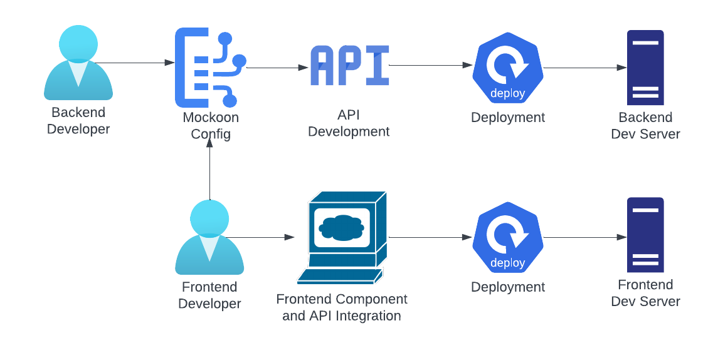
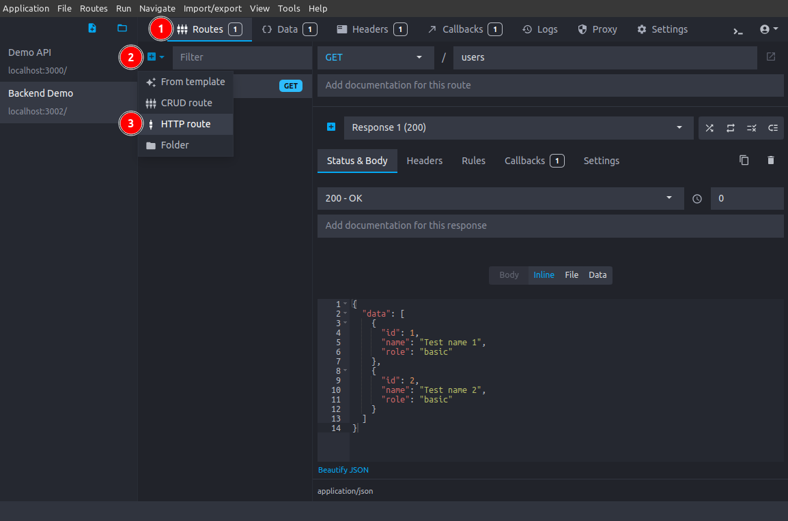
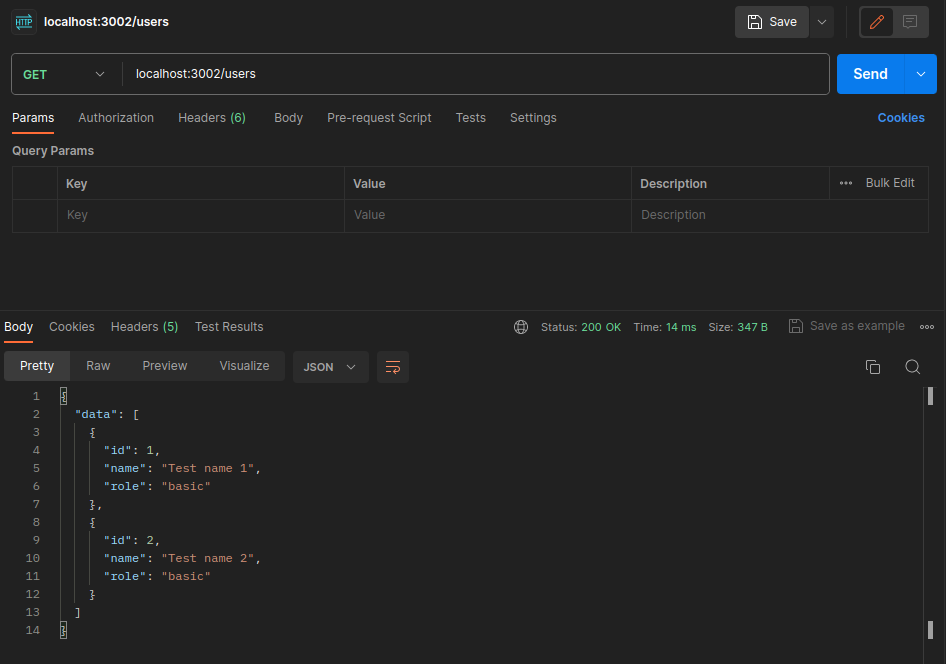
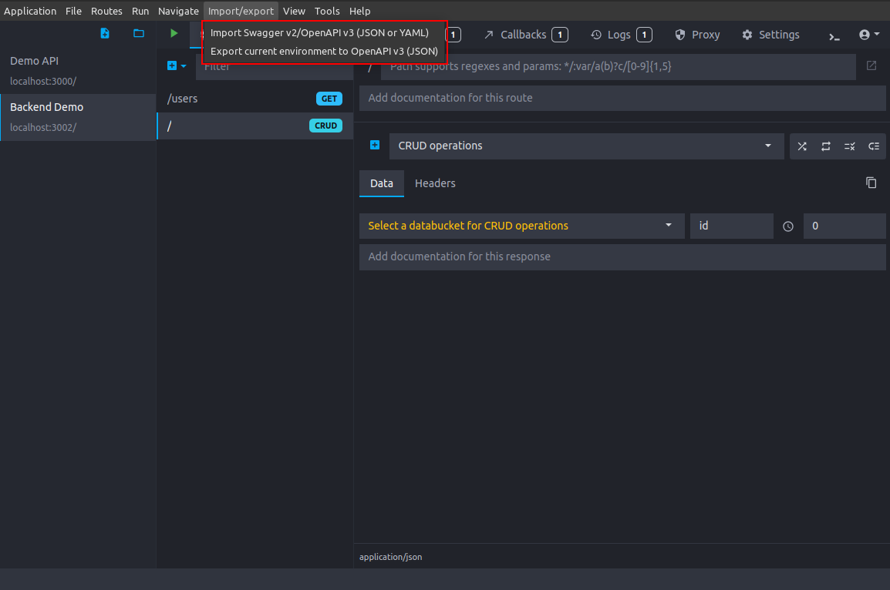

# Mockoon Usage

## Table of Contents

1. [Introduction](#introduction)
   - [The Problem](#the-problem)
   - [Current Pipeline](#current-pipeline)
   - [The Solution](#the-solution)
2. [Why Mockoon?](#2-why-mockoon)
   - [Steps](#steps)
   - [Mockoon Pipeline](#mockoon-pipeline)
3. [Setup](#3-setup)
4. [Usage](#4-usage)
   - [Backend Developers](#backend-developers)
   - [Frontend Developers](#frontend-developers)
5. [Features](#5-features)
   - [Understanding the UI](#understanding-the-ui)
   - [Creating New Environments](#creating-new-environments)
   - [Environment Settings](#environment-settings)
   - [Viewing and Copying Environment Configuration](#viewing-and-copying-environment-configuration)
   - [Opening Environments](#opening-environments)
   - [Adding and Configuring HTTP Routes](#adding-and-configuring-http-routes)
   - [Starting Mockoon Server](#starting-mockoon-server)
   - [Using Postman to Call API](#using-postman-to-call-api)
   - [Copying and Adding Route Configuration](#copying-and-adding-route-configuration)
   - [Toggling and Deleting Routes](#toggling-and-deleting-routes)
6. [Advanced Features](#6-advanced-features)
   - [Using Mockoon Templating](#using-mockoon-templating)
   - [Using Data Buckets](#using-data-buckets)
   - [Adding and Configuring CRUD Routes](#adding-and-configuring-crud-routes)
   - [Using Proxy Mode](#using-proxy-mode)
   - [Requests Logging and Recording](#requests-logging-and-recording)
   - [Import/Export Swagger Documentation](#importexport-swagger-documentation)
   - [Adding Global Routes with Rules](#adding-global-routes-with-rules)
   - [Creating and Using Callbacks](#creating-and-using-callbacks)
7. [Further References](#7-further-references)

## 1. Introduction

### The Problem

There is currently accelerating hindrance in frontend development due to API dependencies across different projects. If the API development is not delivered on time, it can cause delays in development and integration in the frontend as well.

### Current Pipeline


This pipeline requires the backend developer to always be one step ahead of the frontend developer in development of a particular module.

### The Solution

There are two possible ways to avoid delays due to the above pipeline:

- Provide API details to the frontend before development. We can try to use AI tools to do this, but it has been found that these are not reliable. This will also require human intervention for testing the APIs, for example, using different responses.
- Use a mock API server. This will mock the API responses using static or random responses as configured.

[Back to top](#mockoon-usage)

## 2. Why Mockoon?

[Mockoon](https://mockoon.com) is a free and open-source application that is cross-platform and provides an easy and quick way to run mock APIs locally. There is no mandatory login or account requirement for using this.

### Steps

- Backend developer adds Mockoon configuration for endpoints
- Frontend developer imports API configuration into his local Mockoon server

### Mockoon Pipeline



In this pipeline, the frontend developer does not have to wait for the complete development and deployment of the API to start working on the component and integration in the frontend.

[Back to top](#mockoon-usage)

## 3. Setup

Go to the [Mockoon website](https://mockoon.com) and head to the [download page](https://mockoon.com/download/#download-section). Download and install the required package as per your OS.

Take the tour to gain an understanding of the various UI elements and features.

[Back to top](#mockoon-usage)

## 4. Usage

### Backend Developers

The backend developers are expected to use Mockoon for the following purposes:

- Creating and configuring environments (see [Creating New Environments](#creating-new-environments) and [Environment Settings](#environment-settings))
- Adding and configuring routes that the API will support (see [Adding and Configuring HTTP Routes](#adding-and-configuring-http-routes))
  - This includes defining proper response(s) for each route, covering different expected cases. This is crucial for mocking the API properly and use by the frontend developers for integrating
  - This may also include configuring proxy mode as required
- Providing the environment configuration and/or route configurations to the frontend developer(s) (see [Viewing and Copying Environment Configuration](#viewing-and-copying-environment-configuration) and [Copying and Adding Route Configuration](#copying-and-adding-route-configuration))

In addition to above, the developers can also leverage [advanced features](#6-advanced-features) such as templating, data buckets, callbacks, proxy mode, etc. Some advanced features such as CRUD routes might not be used frequently and can be skipped.

### Frontend Developers

The frontend developers are expected to use Mockoon for the following purposes:

- Opening environments or routes from files provided by backend developers (see [Opening Environments](#opening-environments) and [Copying and Adding Route Configuration](#copying-and-adding-route-configuration))
- Modifying environment settings such as introducing global latency. This latency is added to all the routes in that specific environment (see [Environment Settings](#environment-settings))
- Modifying routes for testing purposes such as changing responses, introducing route specific latency (which is added on top of the global environment latency), changing response modes (random, sequential, disabled rules, fallback), toggling routes, etc. (see [Adding and Configuring HTTP Routes](#adding-and-configuring-http-routes) and [Toggling and Deleting Routes](#toggling-and-deleting-routes))
  - Changing responses can be useful for viewing how the frontend is handling different data, string lengths, etc.
  - Introducing latency can be useful for testing the frontend such as viewing loading animations
  - Setting a specific response mode can be useful for testing how the frontend handles the different responses from the API. Depending on the selected mode, responses will be either randomized, sequential (as per the order of responses), disable all rules or use the fallback route.
- Using Postman or the frontend component to call the API for observing responses for the request sent (see [Using Postman to Call API](#using-postman-to-call-api))

In addition to above, the developers can also leverage [advanced features](#6-advanced-features) such as templating, data buckets, callbacks, proxy mode, viewing logs, etc.

[Back to top](#mockoon-usage)

## 5. Features

This section outlines the basic features and process of Mockoon, covering various aspects from environment setup to routes setup.

### Understanding the UI

Refer to the [GUI Cheat Sheet](https://mockoon.com/docs/latest/gui-cheat-sheet/) for reviewing and understanding the different user interface elements in the application.

### Creating New Environments

Mockoon allows you to create isolated environments for your mock APIs. Each environment can have its own routes, settings, and responses.

1. Launch the Mockoon application.
2. Create a new environment:

   1. Click on the **New environment** button. This can be found near the top of the Environments list.
   2. Provide a descriptive name for your environment file and create it.

   

### Environment Settings

Configure global settings for your environment by selecting it and going to the **Settings** tab.


These may include details such as:

- **API URL:** Base URL, port, prefix
- **TLS:** Enabling and setting up TLS for HTTPS support
- **Global Latency:** Delay (latency) for all responses in the environment

### Viewing and Copying Environment Configuration

You can view and copy environment configuration as follows:

1. Right-click on the target environment
2. Click on **Show data file in explorer/finder**
3. At this point, you can copy the JSON file or open it and copy the contents.


Alternatively, you can directly copy the configuration by right-clicking the environment and selecting **Copy configuration to clipboard (JSON)**.

This content can then be pasted in a new file if needed and shared with the frontend developer(s).

### Opening Environments

You can open environments from JSON file on your system as follows:

1. Select **File** in the top menu bar
2. Click on **Open environment**
3. Select the JSON file for the environment you want to open

### Adding and Configuring HTTP Routes

Add new HTTP routes using the following steps:

1. Select the environment in which you want to add the route
2. In the **Routes** tab, click on the **+** icon and select **HTTP route**



Configure the added route with various parameters such as:

- **Method:** Select the corresponding method from the dropdown such as GET, POST, etc.
- **Path:** Define the route path (e.g., "/users")
- **Status & Body:** Set the HTTP status code (e.g., "200 - OK"). Configure the response body (e.g., JSON data). You can also introduce response latency for the selected response
- **Headers:** Add custom headers as and if needed, defining the name and value
- **Rules:** Apply rules for dynamic behavior (e.g., route parameters, body data)
- **Default Response:** Set a default response when using multiple responses for the same route by clicking on the responses dropdown and clicking the flag icon
- **Modes (Random, Sequential, Disabled Rules, Fallback):** Choose how responses are selected by selecting the mode beside the responses dropdown
- **Multiple Responses:** Define alternative responses for the same route. Add new responses using the **+** icon beside the responses dropdown. The Status & Body, Headers and Rules can be separately added for each response

Routes can also be organized into folders as required.

Developers can also add brief documentation for the route and response in the provided fields.

### Starting Mockoon Server

- Once you have configured your environment and added routes, click the green **Start server** button located at the top of the Mockoon interface to start the server
- If you make any changes to configurations, such as adding or changing routes, Mockoon will prompt you to restart the server by clicking on the yellow **Restart server** button


### Using Postman to Call API

You can use Postman for observing requests and responses for the configured API routes in Mockoon:

1. Setup and open [Postman](https://www.postman.com/)
2. Set the request method (GET, POST, etc.) and enter the configured API URL from your Mockoon environment
3. Add any necessary headers or request body
4. Send the request and observe the response returned by Mockoon



### Copying and Adding Route Configuration

You can copy a route configuration following these steps:

1. Select the target route, and right-click on it
2. Click on **Copy configuration to clipboard (JSON)**


You can then paste this content into a file for saving it.

Further, you can also add a route using the copied configuration:

1. Copy the route configuration via the above steps or from a file
2. Click on **Routes** in the top menubar and select **Add route from clipboard**


### Toggling and Deleting Routes

- In case specific routes are temporarily required to be disabled, it can be done so by right-clicking on the route and selecting **Toggle**
- To delete a route, right-click on the route and click on **Delete** and then **Confirm deletion**


[Back to top](#mockoon-usage)

## 6. Advanced Features

This section outlines some of the advanced features that Mockoon offers, which might not be used regularly, but can be useful from time to time.

### Using Mockoon Templating

- In the route configuration, utilize [Handlebars.js](https://handlebarsjs.com/) and [Faker.js](https://fakerjs.dev/) templating syntax to generate dynamic response data
- Examples include using repeating loops and accessing query or URL parameters to dynamically generate response data. For example, for a route `/users` returning an array of user data, a template like follows may be used to generate 10 random users:
  ```json
  {
    "data": [
      {{#repeat 10}}
      {
        "id": {{faker "number.int"}},
        "name": "{{faker "person.fullName"}}",
        "email": "{{faker "internet.email"}}",
        "username": "{{faker "internet.userName"}}",
      }
      {{/repeat}}
    ]
  }
  ```

### Using Data Buckets

A data bucket is a key value store where you can create reusable content or data for your routes.

To create a new data bucket, follow these steps:

1. Select the target environment and open the **Data** tab
2. Click on the **+** icon for adding new data bucket
3. Name the data bucket and add the required JSON data


This data can also contain templating, and will persist the generated random content as long as the server remains running.

### Adding and Configuring CRUD Routes

CRUD routes can generate multiple endpoints to perform CRUD operations (Create, Read, Update, Delete) on data buckets. To create a CRUD route:

1. Select the target environment and click on the **+** icon in the routes list.
2. Select the **CRUD route** entry


This route can be configured with the following:

- **Path:** Define the CRUD route path
- **Data:** Select the data bucket to be used. You can also introduce response latency for the selected response
- **Headers:** Add custom headers as and if needed, defining the name and value
- **Modes (Random, Sequential, Disabled Rules, Fallback):** Choose how responses are selected by selecting the mode beside the responses dropdown

Refer to the official Mockoon documentation to learn more about the operations allowed in CRUD routes.

### Using Proxy Mode

Mockoon supports partial mocking of API endpoints by forwarding the requests that do not match a declared route to the URL of your choice. This can, for example, be used for using already developed and deployed APIs.

1. Select the target environment and click on the **Proxy** tab
2. Enable the proxy mode by checking the box
3. Enter the server URL to which you want to forward the calls


Additionally, proxy specific headers can also be added, both to the forwarded request and the response received from the target API.

### Requests Logging and Recording

For easier debugging, Mockoon records all entering requests and all the corresponding outgoing responses for each of your mock API. To access an environment's log, click on the **Logs** tab at the top of the window. The list shows all intercepted requests and how Mockoon answered to them.


You can also click on the **Mock** button (**+** icon) against a specific request log to directly add it to your environment routes.

Mockoon can also automatically create mock API endpoints every time a request is logged. To activate this feature, click on the **Record** button at the top of the logs view.

### Import/Export Swagger Documentation

Mockoon allows exporting and importing the environment Swagger documentation. However, it should be noted that exporting the documentation is limited as it does not contain any schema details.

For importing/exporting, click on **Import/export** in the top menubar and select the corresponding option.



### Adding Global Routes with Rules

If you want to serve the same responses based on the same rules for all or part of your endpoints, you can create global routes using the fallback mode and a wildcard path. This is useful if you want to protect all your endpoints by checking if an "Authorization" header is present or if you want to verify that all your requests contain a specific property in their body.

For implementing this, follow the below steps:

1. **Create a wildcard route:** To create a global route, you first need to create a new HTTP route that will match all the endpoints you want to protect. To do so, create a new route and select **All methods** in the method dropdown
2. **Create your global responses and rules:** The second step is to create one or more responses with rules. For example, you can create a response checking that the request contains an Authorization header and returning a 401 error if's not present
3. **Activate the fallback mode:** Once your route is created and your responses customized, activate the fallback mode by clicking on the **Fallback** icon next to the response list


### Creating and Using Callbacks

Callbacks are a way to make one or more HTTP calls after an entering request reaches your route. This is useful to call other APIs or to trigger a webhook.

To create a callback, follow the below steps:

1. Select the target environment and click on the **Callbacks** tab
2. Add a new callback by clicking on the **+** button


The callback can be configured with the following:

- **URL:** The URL to call
- **Method:** The HTTP method to use for the call
- **Body:** The body to send with the call. This also support templating
- **Headers:** The headers to send with the call

To link a callback to a route response:

1. Select the route and choose **Callbacks** in the route response menu
2. Click on the **+** button to add a new callback, and select the callback you want to link. You can also add callback latency to this.


[Back to top](#mockoon-usage)

## 7. Further References

- [Mockoon official documentation](https://mockoon.com/docs/latest/about/)

[Back to top](#mockoon-usage)
